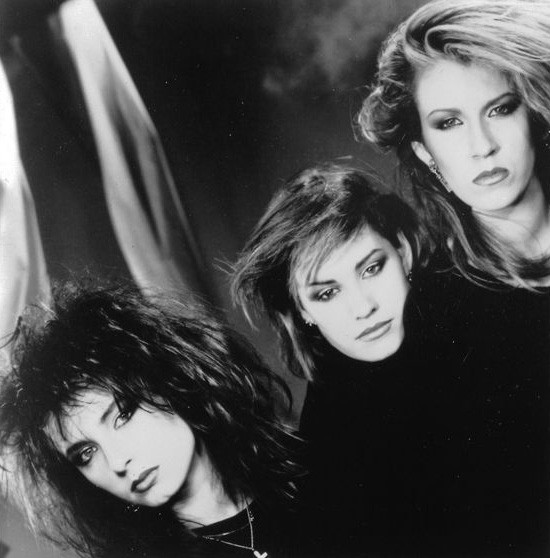

# Bananarama

## Artist Profile

Bananarama was formed in London in 1981 by childhood friends Keren Woodward and Sarah Dallin and their friend Siobhan Fahey.

After a debut single produced by former Sex Pistols member Paul Cook (reaching #92), they teamed up with ex Specials member Terry Hall's new band, Fun Boy Three. "It Ain't What You Do", released in February 1982 entered the UK charts at number 4. International success came with their self-titled second album produced by Tony Swain and Steve Jolley and the monster hit single "Cruel Summer". In 1986, the women teamed up with UK dance music super-producers Stock, Aitken &amp; Waterman and achieved number one all around the world, including the US, with their cover of the Shocking Blue's classic "Venus". 

Siobhan decided to leave the trio to form Shakespear's Sister in 1988. She was replaced by Jacquie O'Sullivan who had appeared with the original Bananarama line-up in the Eurythmics video for "Who's That Girl", back in June 1983. In the same year, the band was named by the Guinness Book of Records as the most successful female group in pop history, beating Supremes. They celebrated by releasing a SAW-produced version of the Supremes' "Nathan Jones". 

Jacquie left in late 1991. Sara and Keren have since continued as a duo. Following a one-off reunion recording of ABBA's "Waterloo" with Siobhan in April 1998 for Channel 4's "Eurotrash" TV series hosted by Jean Paul Gaultier, the duo returned in 2001 with their eighth studio album, Exotica. In February 2002, Bananarama celebrated their 20th anniversary, joined on-stage by Siobhan. Their 2005 club hit "Move In My Direction" is their first UK single release since 1993. Their 2005 album "Drama" was followed in 2009 with the album "Viva".

Siobhan temporarily rejoined Bananarama in 2017 for a one-off tour across UK and North America between November 2017 and August 2018. In 2019, Sara and Keren released their sixth album as a duo, to critical and fan acclaim. They released their joint-autobiography "Really Saying Something" in 2020. 

2022 marks Bananarama's official 40th anniversary, which they celebrated by releasing their seventh album as a duo - and twelfth studio album overall - "Masquerade", which has received universally excellent reviews.

## Artist Links

- [http://www.bananarama.co.uk](http://www.bananarama.co.uk)
- [http://www.facebook.com/Bananarama](http://www.facebook.com/Bananarama)
- [http://www.instagram.com/bananarama_official](http://www.instagram.com/bananarama_official)
- [http://twitter.com/vivabananarama](http://twitter.com/vivabananarama)
- [http://en.wikipedia.org/wiki/Bananarama](http://en.wikipedia.org/wiki/Bananarama)
- [http://www.youtube.com/user/BananaramaOfficial](http://www.youtube.com/user/BananaramaOfficial)
- 
- [http://musicianbio.org/bananarama](http://musicianbio.org/bananarama)
- [http://www.musicianguide.com/biographies/1608000109/Bananarama.html](http://www.musicianguide.com/biographies/1608000109/Bananarama.html)

## See also

- [Venus](Venus.md)
