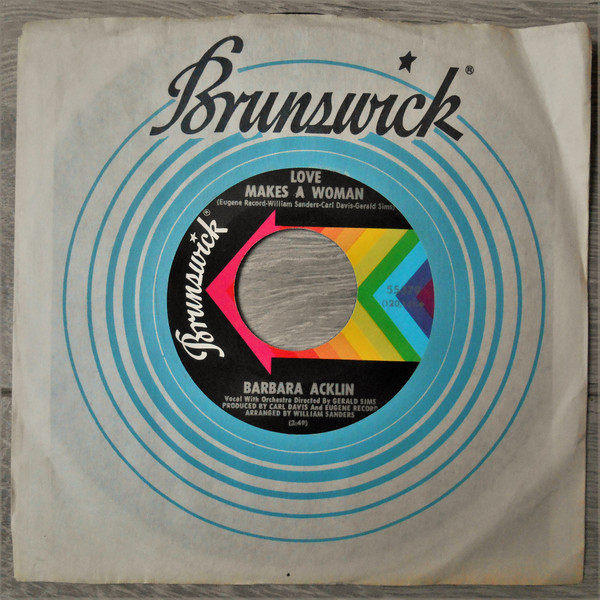

# Love Makes A Woman

By Barbara Acklin

## Album Data

[Discogs URL](https://www.discogs.com/release/7971678-Barbara-Acklin-Love-Makes-A-Woman)

- Label: Brunswick
- Formats: Vinyl, 7", 45 RPM, Single
- Genres: Funk / Soul, Rhythm & Blues, Soul
- Rating: 4.25
- Released: 1968-06-00
- Year: 1968
- Release ID: 7971678
- Media condition: 
- Sleeve condition: 
- Speed: 
- Weight: 
- Notes: 

## Album Tracks

| **Position** | **Title** | **Duration** |
|--------------|-----------|--------------|
| A | **Love Makes A Woman** | 2:49 |
| B | **Come And See Me Baby** | 2:42 |

## Artist Roles

| **Name** | **Role** |
|----------|----------|
| **Sonny Sanders** | Arranged By |
| **Gerald Sims** | Directed By [Orchestra] |
| **Carl Davis** | Producer |
| **Eugene Record** | Producer |

