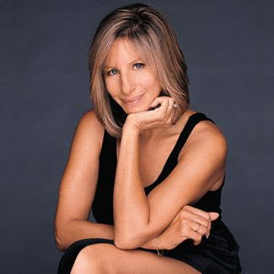

# Barbra Streisand

## Artist Profile

American singer-songwriter, author, actress, writer, film producer and director, born April 24, 1942 in Brooklyn, New York, United States. She was married to Elliott Gould from 1963-1970; their son is Jason Gould. She has been married to James Brolin since 1998. Roslyn Kind is her younger half-sister.

## Artist Links

- [https://barbrastreisand.com/](https://barbrastreisand.com/)
- [https://www.barbra-archives.info/](https://www.barbra-archives.info/)
- [https://www.facebook.com/barbrastreisand/](https://www.facebook.com/barbrastreisand/)
- [https://www.instagram.com/barbrastreisand](https://www.instagram.com/barbrastreisand)
- [https://twitter.com/barbrastreisand](https://twitter.com/barbrastreisand)
- [https://en.wikipedia.org/wiki/Barbra_Streisand](https://en.wikipedia.org/wiki/Barbra_Streisand)
- [https://www.youtube.com/user/barbrastreisandVEVO](https://www.youtube.com/user/barbrastreisandVEVO)
- [https://www.britannica.com/biography/Barbra-Streisand](https://www.britannica.com/biography/Barbra-Streisand)
- [https://www.imdb.com/name/nm0000659/](https://www.imdb.com/name/nm0000659/)

## See also

- [Wet](Wet.md)
