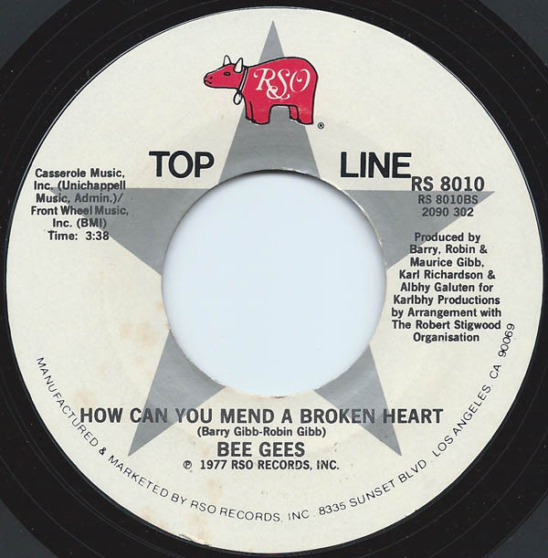

# To Love Somebody / How Can You Mend A Broken Heart

By Bee Gees

## Album Data

[Discogs URL](https://www.discogs.com/release/1861891-Bee-Gees-To-Love-Somebody-How-Can-You-Mend-A-Broken-Heart)

- Label: RSO
- Formats: Vinyl, 7", Single
- Genres: Pop, Vocal
- Rating: 4.5
- Released: 1980
- Year: 1980
- Release ID: 1861891
- Media condition: 
- Sleeve condition: 
- Speed: 
- Weight: 
- Notes: 

## Album Tracks

| **Position** | **Title** | **Duration** |
|--------------|-----------|--------------|
| A | **To Love Somebody** | 3:55 |
| B | **How Can You Mend A Broken Heart** | 3:38 |

## Artist Roles

| **Name** | **Role** |
|----------|----------|
| **Albhy Galuten** | Producer |
| **Karl Richardson** | Producer |
| **Robin Gibb, Barry Gibb & Maurice Gibb** | Producer |
| **Barry Gibb** | Written-By |
| **Robin Gibb** | Written-By |

