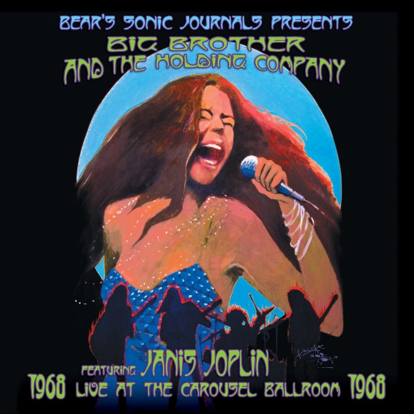

# Live At The Carousel Ballroom 1968

By Big Brother & The Holding Company

## Album Data

[Discogs URL](https://www.discogs.com/release/3974330-Big-Brother-The-Holding-Company-featuring-Janis-Joplin-Live-At-The-Carousel-Ballroom-1968)

- Label: Music On Vinyl
Legacy
Columbia
- Formats: Vinyl, LP, Album, Remastered
- Genres: Rock, Blues, Blues Rock, Psychedelic Rock
- Rating: 4.47
- Released: 2012-04-16
- Year: 2012
- Release ID: 3974330
- Media condition: 
- Sleeve condition: 
- Speed: 
- Weight: 
- Notes: 

## Album Tracks

| **Position** | **Title** | **Duration** |
|--------------|-----------|--------------|
| A1 | **Combination Of The Two** | 4:35 |
| A2 | **I Need A Man To Love** | 6:39 |
| A3 | **Flower In The Sun** | 3:11 |
| A4 | **Light Is Faster Than Sound** | 6:02 |
| B1 | **Summertime** | 4:35 |
| B2 | **Catch Me Daddy** | 5:07 |
| B3 | **It's A Deal** | 2:28 |
| B4 | **Call On Me** | 4:04 |
| C1 | **Jam - I'm Mad (Mad Man Blues)** | 6:51 |
| C2 | **Piece Of My Heart** | 4:49 |
| C3 | **Coo Coo** | 6:22 |
| D1 | **Ball & Chain** | 9:22 |
| D2 | **Down On Me** | 2:44 |
|  | **Bonus Track** |  |
| D3 | **Call On Me** | 3:56 |

## Artist Roles

| **Name** | **Role** |
|----------|----------|
| **Phil Yarnall** | Art Direction, Design |
| **Smay Design** | Art Direction, Design |
| **Peter Albin** | Bass, Vocals |
| **Mouse Studios** | Cover, Artwork, Typography [Lettering] |
| **Stanley Mouse** | Cover, Artwork, Typography [Lettering] |
| **Dave Getz** | Drums, Vocals |
| **James Gurley** | Guitar, Vocals |
| **Sam Andrew** | Guitar, Vocals |
| **Janis Joplin** | Lead Vocals |
| **Bear (6)** | Liner Notes |
| **Bob Scott (11)** | Liner Notes |
| **Jaan Uhelszki** | Liner Notes |
| **Joel Selvin** | Liner Notes |
| **John Meyer** | Liner Notes |
| **Rhoney Stanley** | Liner Notes |
| **Sheilah Stanley** | Liner Notes |
| **Starfinder Stanley** | Liner Notes |
| **David Byrnes (2)** | Management |
| **Jeffrey Jampol** | Management |
| **John Branca** | Management |
| **Paul Stubblebine** | Mastered By |
| **Amalie R. Rothschild** | Photography By |
| **Bob Cato** | Photography By |
| **Bob Seidemann** | Photography By |
| **Elliott Landy** | Photography By |
| **Jerry Burchard** | Photography By |
| **Ted Streshinsky** | Photography By |
| **Adam Farber** | Production Manager [Project Direction] |
| **Jim Parham** | Production Manager [Project Direction] |
| **Marisa Magliola** | Production Manager [Project Direction] |
| **Owsley Stanley** | Recorded By, Producer |
| **Adam Farber** | Supervised By |
| **Starfinder Stanley** | Supervised By |
| **Owsley Stanley** | Supervised By [Mastering] |

