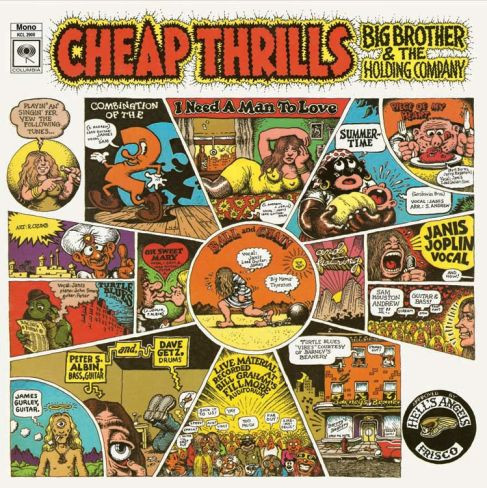

# Cheap Thrills

By Big Brother & The Holding Company

## Album Data

[Discogs URL](https://www.discogs.com/release/4056419-Big-Brother-The-Holding-Company-Cheap-Thrills)

- Label: Legacy
Columbia
- Formats: Vinyl, LP, Album, Limited Edition, Numbered, Reissue, Mono
- Genres: Rock, Psychedelic Rock, Blues Rock, Folk Rock
- Rating: 4.58
- Released: 2012-11-23
- Year: 1968
- Release ID: 4056419
- Media condition: 
- Sleeve condition: 
- Speed: 
- Weight: 
- Notes: 

## Album Tracks

| **Position** | **Title** | **Duration** |
|--------------|-----------|--------------|
| A1 | **Combination Of The Two** | 5:47 |
| A2 | **I Need A Man To Love** | 4:51 |
| A3 | **Summertime** | 3:56 |
| A4 | **Piece Of My Heart** | 4:13 |
| B1 | **Turtle Blues** | 4:20 |
| B2 | **Oh, Sweet Mary** | 4:13 |
| B3 | **Ball And Chain** | 9:27 |

## Artist Roles

| **Name** | **Role** |
|----------|----------|
| **Peter Albin** | Bass |
| **Sam Andrew** | Bass, Guitar |
| **Robert Crumb** | Cover [Cover Artwork] |
| **Dave Getz** | Drums |
| **Fred Catero** | Engineer |
| **James Gurley** | Engineer |
| **Janis Joplin** | Engineer |
| **Jerry Hochman** | Engineer |
| **Roy Segal** | Engineer |
| **James Gurley** | Guitar |
| **Kevin Gray** | Mastered By, Lacquer Cut By |
| **Janis Joplin** | Vocals |

