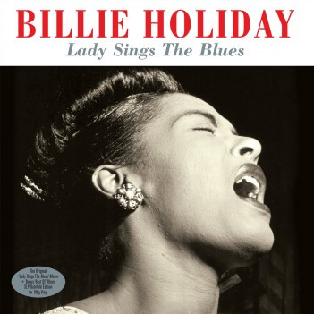

# Lady Sings The Blues

By Billie Holiday

## Album Data

[Discogs URL](https://www.discogs.com/release/5260357-Billie-Holiday-Lady-Sings-The-Blues)

- Label: Not Now Music
- Formats: Vinyl
Vinyl
All Media, LP, Album, Reissue, LP, Compilation, Compilation
- Genres: Jazz, Blues
- Rating: 4.64
- Released: 2013
- Year: 2013
- Release ID: 5260357
- Media condition: 
- Sleeve condition: 
- Speed: 
- Weight: 
- Notes: 

## Album Tracks

| **Position** | **Title** | **Duration** |
|--------------|-----------|--------------|
|  | **Lady Sings The Blues** |  |
| A1 | **Lady Sings The Blues** |  |
| A2 | **Trav’lin Light** |  |
| A3 | **I Must Have That Man** |  |
| A4 | **Some Other Spring** |  |
| A5 | **Strange Fruit** |  |
| A6 | **No Good Man** |  |
| B1 | **God Bless The Child** |  |
| B2 | **Good Morning Heartache** |  |
| B3 | **Love Me Or Leave Me** |  |
| B4 | **Too Marvellous For Words** |  |
| B5 | **Willow Weep For Me** |  |
| B6 | **I Thought About You** |  |
|  | **The Best Of** |  |
| C1 | **Blue Moon** |  |
| C2 | **You Go To My Head** |  |
| C3 | **These Foolish Things (Remind Me Of You)** |  |
| C4 | **Love For Sale** |  |
| C5 | **Speak Low** |  |
| C6 | **I'm A Fool To Want You** |  |
| D1 | **Just One Of Those Things** |  |
| D2 | **He's Funny That Way** |  |
| D3 | **Stormy Weather** |  |
| D4 | **Come Rain Or Come Shine** |  |
| D5 | **All Of You** |  |
| D6 | **Isn't This A Lovely Day?** |  |

## Artist Roles

| **Name** | **Role** |
|----------|----------|
| **Benny Carter** | Alto Saxophone |
| **Willie "The Lion" Smith** | Alto Saxophone |
| **Aaron Bell** | Bass |
| **John Simmons** | Bass |
| **Leonard Gaskin** | Bass |
| **Anthony Sciacca** | Clarinet |
| **Joe Mondragon** | Double Bass |
| **Ray Brown** | Double Bass |
| **Alvin Stoller** | Drums |
| **Chico Hamilton** | Drums |
| **Cozy Cole** | Drums |
| **Larry Bunker** | Drums |
| **Lenny McBrowne** | Drums |
| **Lenny McBrowne** | Drums |
| **Barney Kessel** | Guitar |
| **Billy Taylor** | Piano |
| **Bobby Tucker** | Piano |
| **Jimmy Rowles** | Piano |
| **Oscar Peterson** | Piano |
| **Michael Heatley** | Sleeve Notes |
| **Ben Webster** | Tenor Saxophone |
| **Flip Phillips** | Tenor Saxophone |
| **Paul Quinichette** | Tenor Saxophone |
| **Charlie Shavers** | Trumpet |
| **Harry Edison** | Trumpet |
| **Billie Holiday** | Vocals |

