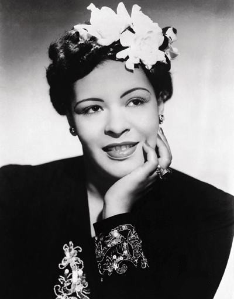

# Billie Holiday

## Artist Profile

Billie Holiday (born April 7, 1915, Philadelphia, Pennsylvania, USA - died July 17, 1959, New York City, New York, USA) was an American jazz singer and songwriter.

Daughter of jazz guitarist Clarence Holiday. Godmother of Mala Waldron and Lorraine Feather.

She made her debut circa 1930 singing in various nightclubs in Harlem. In early 1933, the producer John Hammond heard her sing and was impressed by her talent. In 1935 he signed her to Brunswick Records. She made her first recordings with Benny Goodman. Also in 1935 she made her first appearance in a movie, with more roles in the 1940's. From 1939 she started recording songs with notable jazz artists of that time. In the 1950's, her voice was deteriorating as a result of unhappy relationships, heroin use and excessive drinking. In May 1959 she collapsed and was taken to the Metropolitan Hospital in New York City for treatment of liver and heart disease. She was arrested for heroin possession while she lay dying.

She was inducted into the Blues Hall of Fame in 1991 and the Rock And Roll Hall of Fame in 2000 (Early Influence).

## Artist Links

- [https://billieholiday.com/](https://billieholiday.com/)
- [https://www.ladyday.net/](https://www.ladyday.net/)
- [https://en.wikipedia.org/wiki/Billie_Holiday](https://en.wikipedia.org/wiki/Billie_Holiday)
- [https://www.britannica.com/biography/Billie-Holiday](https://www.britannica.com/biography/Billie-Holiday)
- [https://reset.me/story/how-billie-holiday-was-hunted-down-in-the-early-days-of-the-war-on-drugs/](https://reset.me/story/how-billie-holiday-was-hunted-down-in-the-early-days-of-the-war-on-drugs/)
- [https://www.imdb.com/name/nm0390507/](https://www.imdb.com/name/nm0390507/)
- [https://www.biography.com/musician/billie-holiday](https://www.biography.com/musician/billie-holiday)
- [https://adp.library.ucsb.edu/index.php/mastertalent/detail/102008/Holiday_Billie](https://adp.library.ucsb.edu/index.php/mastertalent/detail/102008/Holiday_Billie)
- [https://www.treccani.it/enciclopedia/billie-holiday/](https://www.treccani.it/enciclopedia/billie-holiday/)
- [https://www.jazzdisco.org/billie-holiday/discography/](https://www.jazzdisco.org/billie-holiday/discography/)

## See also

- [Lady Sings The Blues](Lady_Sings_The_Blues.md)
