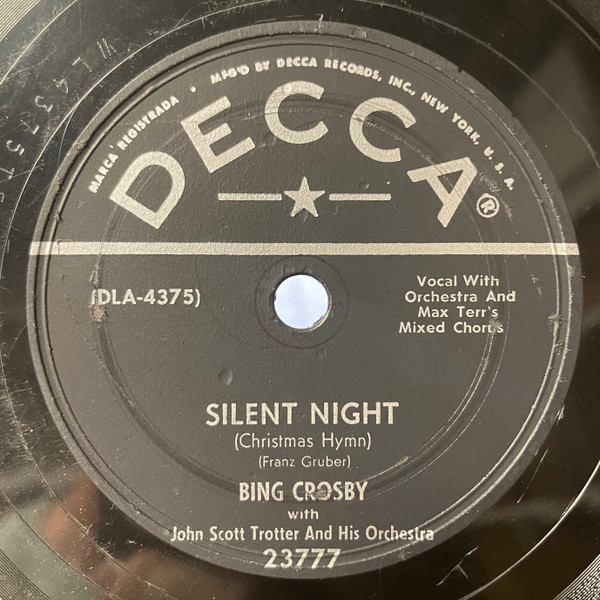

# Silent Night (Christmas Hymn) / Adeste Fideles (Oh, Come, All Ye Faithful)

By Bing Crosby

## Album Data

[Discogs URL](https://www.discogs.com/release/4875711-Bing-Crosby-Silent-Night-Christmas-Hymn-Adeste-Fideles-Oh-Come-All-Ye-Faithful)

- Label: MCA Records
- Formats: Vinyl, 7", 45 RPM, Reissue
- Genres: Pop, Vocal
- Rating: 5
- Released: 1980
- Year: 1950
- Release ID: 4875711
- Media condition: 
- Sleeve condition: 
- Speed: 
- Weight: 
- Notes: 

## Album Tracks

| **Position** | **Title** | **Duration** |
|--------------|-----------|--------------|
| A | **Silent Night (Christmas Hymn)** |  |
| B | **Adeste Fideles (Oh, Come, All Ye Faithful)** |  |

## Artist Roles

| **Name** | **Role** |
|----------|----------|
| **Max Terr's Mixed Chorus** | Chorus |
| **John Scott Trotter And His Orchestra** | Orchestra |

