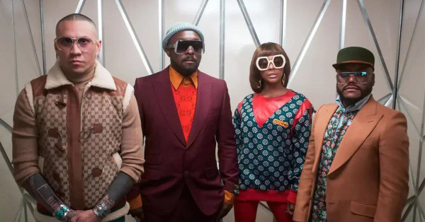

# Black Eyed Peas

## Artist Profile

Black Eyed Peas (often named The Black Eyed Peas, abbreviated BEP) is an American hip hop group. It mainly composed of rappers will.i.am, apl.de.ap, and Taboo. Originally an alternative hip hop group, they have since added R&B, soul, funk, dance, electro and techno influences. Though formed in Los Angeles, California in 1995, it was not until after two studio albums in 1998 and 2000, respectively with the release of their third album, Elephunk in 2003 that they found widespread acclaim and achieved high record sales.

## Artist Links

- [http://www.blackeyedpeas.com](http://www.blackeyedpeas.com)
- [http://www.wheresthelove.com](http://www.wheresthelove.com)
- [http://www.facebook.com/blackeyedpeas](http://www.facebook.com/blackeyedpeas)
- [http://www.instagram.com/bep](http://www.instagram.com/bep)
- [http://www.myspace.com/blackeyedpeas](http://www.myspace.com/blackeyedpeas)
- [http://twitter.com/bep](http://twitter.com/bep)
- [http://en.wikipedia.org/wiki/The_Black_Eyed_Peas](http://en.wikipedia.org/wiki/The_Black_Eyed_Peas)
- [http://fr.wikipedia.org/wiki/The_Black_Eyed_Peas](http://fr.wikipedia.org/wiki/The_Black_Eyed_Peas)
- [http://www.youtube.com/user/BlackEyedPeasVEVO](http://www.youtube.com/user/BlackEyedPeasVEVO)

## See also

- [Behind The Front](Behind_The_Front.md)
