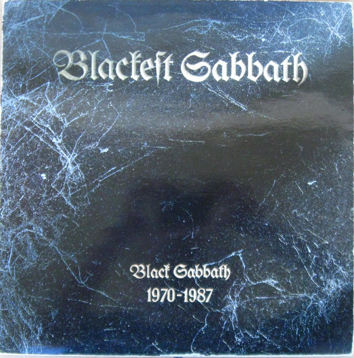

# Black Sabbath

By Black Sabbath

## Album Data

[Discogs URL](https://www.discogs.com/release/8867448-Black-Sabbath-Black-Sabbath)

- Label: Rhino Records (2)
Warner Bros. Records
- Formats: Vinyl, LP, Album, Limited Edition, Reissue, Remastered
- Genres: Rock, Hard Rock, Blues Rock
- Rating: 4.71
- Released: 2016-08-05
- Year: 1970
- Release ID: 8867448
- Media condition: 
- Sleeve condition: 
- Speed: 
- Weight: 
- Notes: 

## Album Tracks

| **Position** | **Title** | **Duration** |
|--------------|-----------|--------------|
| A1 | **Black Sabbath** |  |
| A2 | **The Wizard** |  |
| A3 | **Wasp/Behind The Wall Of Sleep/Bassically/N.I.B.** |  |
| B1 | **Wicked World** |  |
| B2 | **A Bit Of Finger** |  |
| B3 | **Sleeping Village** |  |
| B4 | **Warning** |  |

## Artist Roles

| **Name** | **Role** |
|----------|----------|
| **Geezer Butler** | Bass Guitar |
| **Keef (4)** | Design, Photography By |
| **Bill Ward** | Drums |
| **Barry Sheffield** | Engineer |
| **Tom Allom** | Engineer |
| **Tony Iommi** | Lead Guitar |
| **Rodger Bain** | Producer |
| **Ozzy Osbourne** | Vocals, Harmonica |

