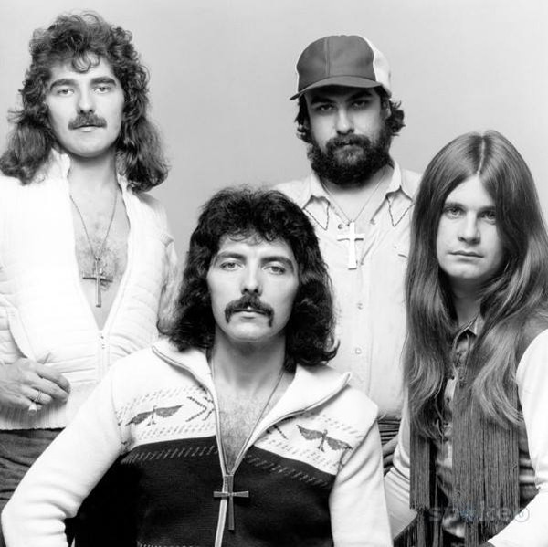

# Black Sabbath

## Artist Profile

Considered by many to be the first heavy metal band, Black Sabbath was formed in 1968 by Tony Iommi, Ozzy Osbourne, Geezer Butler and Bill Ward.
The band's original name was the Polka Tulk Blues Band (later shortened to Polka Tulk) and later on changed to Earth (12) before becoming Black Sabbath inspired by an Italian horror movie of the same name.
The original line-up lasted until 1979, after which Osbourne was fired and replaced by Ronnie James Dio. The line-up changes would continue, with no line-up remaining intact for consecutive studio releases. Throughout the changes, only Tony Iommi and keyboardist Geoff Nicholls, who also joined the band in 1979, would remain with Black Sabbath, although Nicholls would not always be credited as a full member. In 1997, Iommi, Butler, Ward, and Osbourne reunited, touring and releasing a live album in 1998, although a long-rumored studio release did not appear (the group attempted to record a new album in 2001 with producer Rick Rubin but the sessions were scrapped). After that, the group periodically reunited to tour with Ozzy's "Ozzfest" tour. In 2004, longtime keyboardist Geoff Nicholls was replaced by Adam Wakeman for an Ozzfest tour. No reason was given for the replacement. In 2006, the original line-up was inducted into the Rock 'n' Roll Hall Of Fame.

In 2007, Tony Iommi, Geezer Butler, Ronnie James Dio, and drummer Vinny Appice (who were featured on 1981's "Mob Rules" and 1992's "Dehumanizer") announced that they would tour together as Heaven &amp; Hell (2) (with Iommi, who owns the Black Sabbath name, deciding to keep the Black Sabbath name solely for the original line-up in light of their Rock 'n' Roll HOF induction) to support a Dio-era greatest hits release, which also featured 3 new Dio/Iommi compositions. A brand new live album was released under the Heaven & Hell name that same year, followed by a studio album in 2009.

In 2009, Osbourne sued Iommi over control of the Black Sabbath name. The lawsuit was settled the following year. In late 2011, it was announced that the original line-up would be recording and touring. Shortly, afterward, Bill Ward dropped out, stating he had been given a contract that was "unsignable". The three remaining members opted to continue without him. In 2013, the band released "13", their first studio album with Osbourne in 34 years. The band played their final live show in Birmingham, UK, on February 4, 2017. Although the band has announced that full-scale touring is done, Tony Iommi has stated that the door is still open for future music and possible live appearances.

Line-Ups:
Guitar:
Tony Iommi - 1968-2017

Vocals:
Ozzy Osbourne - 1968-1977, 1978-1979, 1997-2017
Dave Walker (6) - 1977-1978 (rehearsals and a TV appearance only)
Ronnie James Dio - 1979-1982, 1991-1992
Ian Gillan - 1983-1984
Glenn Hughes - 1985-1986
Ray Gillen - 1986-1987 (live only)
Tony Martin - 1987-1991, 1993-1996

Bass:
Geezer Butler - 1968-1984, 1991-1994, 1997-2017
Craig Gruber - 1979 (rehearsals only while Butler contemplated leaving the band, the extent of his participation has been disputed)
Gordon Copley -1985 (rehearsals and one studio track only)
Dave Spitz "The Beast" - 1985-1986, 1987 (live appearances only in 1987)
Bob Daisley - 1987 (studio only)
Jo Burt - 1987 (live only)
Laurence Cottle - 1988 (studio only)
Neil Murray - 1989-1992, 1995-1996

Drums:
Bill Ward - 1968-1980, 1983 (studio only in 1983), 1994 (live appearances), 1997-2011
Vinny Appice - 1981-1982, 1991-1992, 1998 (live only in 1998, filling in for a sick Bill Ward)
Bev Bevan - 1983-1984, 1987 (live only)
Eric Singer - 1985-1987
Terry Chimes - 1987-1988 (live only)
Cozy Powell - 1988-1991, 1994-1995
Bobby Rondinelli - 1993-1994, 1995 (live appearances only in 1995)
Mike Bordin - 1997 (live only, not a full member)
Brad Wilk - 2013 (studio only, not a full member)
Tommy Clufetos - 2012-2017 (live only, not a full member)

Keyboards:
Rick Wakeman - 1973 (studio only, not a full member)
Jezz Woodroffe - ?-1977 (not a full member)
Don Airey - 1978 (not a full member)
Geoff Nicholls - 1979-2004
Adam Wakeman - 2004-2017 (live only, not a full member)

## Artist Links

- [https://www.blacksabbath.com/](https://www.blacksabbath.com/)
- [https://www.facebook.com/BlackSabbath](https://www.facebook.com/BlackSabbath)
- [https://twitter.com/blacksabbath](https://twitter.com/blacksabbath)
- [https://www.youtube.com/user/OfficialSabbath](https://www.youtube.com/user/OfficialSabbath)
- [https://www.black-sabbath.com/](https://www.black-sabbath.com/)
- [https://en.wikipedia.org/wiki/Black_Sabbath](https://en.wikipedia.org/wiki/Black_Sabbath)

## See also

- [Black Sabbath](Black_Sabbath.md)
- [Master Of Reality](Master_Of_Reality.md)
- [Paranoid](Paranoid.md)
