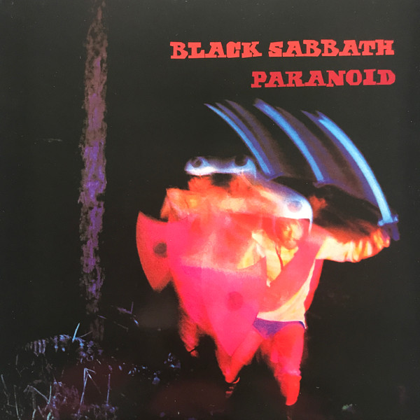

# Paranoid

By Black Sabbath

## Album Data

[Discogs URL](https://www.discogs.com/release/8867485-Black-Sabbath-Paranoid)

- Label: Rhino Records (2)
Warner Bros. Records
- Formats: Vinyl, LP, Album, Limited Edition, Reissue, Remastered
- Genres: Rock, Hard Rock, Heavy Metal
- Rating: 4.71
- Released: 2016-08-05
- Year: 1970
- Release ID: 8867485
- Media condition: 
- Sleeve condition: 
- Speed: 
- Weight: 
- Notes: 

## Album Tracks

| **Position** | **Title** | **Duration** |
|--------------|-----------|--------------|
| A1 | **War Pigs / Luke's Wall** | 7:55 |
| A2 | **Paranoid** | 2:47 |
| A3 | **Planet Caravan** | 4:29 |
| A4 | **Iron Man** | 5:54 |
| B1 | **Electric Funeral** |  |
| B2 | **Hand Of Doom** |  |
| B3 | **Rat Salad** |  |
| B4 | **Jack The Stripper / Fairies Wear Boots** |  |

## Artist Roles

| **Name** | **Role** |
|----------|----------|
| **Terence Butler** | Bass Guitar |
| **Bill Ward** | Composed By |
| **John Osbourne (3)** | Composed By |
| **Terence Butler** | Composed By |
| **Tony Iommi** | Composed By |
| **Keef (4)** | Design [Album], Photography By |
| **Bill Ward** | Drums |
| **Brian Humphries** | Engineer |
| **Tom Allom** | Engineer |
| **Sean Magee** | Lacquer Cut By |
| **Tony Iommi** | Lead Guitar |
| **Rodger Bain** | Producer |
| **Ozzy Osbourne** | Vocals |

