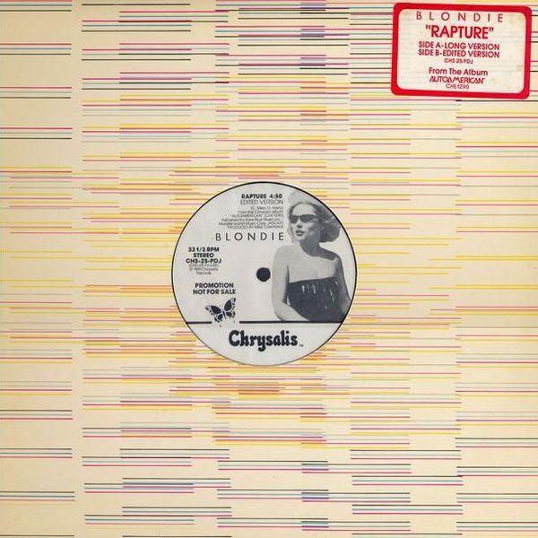

# Rapture

By Blondie

## Album Data

[Discogs URL](https://www.discogs.com/release/647698-Blondie-Rapture)

- Label: Chrysalis
- Formats: Vinyl, 7", 45 RPM, Single, Styrene
- Genres: Electronic, Rock, New Wave, Hip Hop, Disco
- Rating: 4.21
- Released: 1981
- Year: 1981
- Release ID: 647698
- Media condition: 
- Sleeve condition: 
- Speed: 
- Weight: 
- Notes: 

## Album Tracks

| **Position** | **Title** | **Duration** |
|--------------|-----------|--------------|
| A | **Rapture** | 6:33 |
| B | **Walk Like Me** | 3:46 |

## Artist Roles

| **Name** | **Role** |
|----------|----------|
| **Steve Hall** | Lacquer Cut By |
| **Martin Hoffman (3)** | Photography By |
| **Mike Chapman** | Producer |

