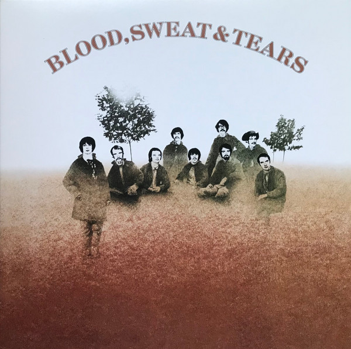

# Blood, Sweat And Tears

By Blood, Sweat And Tears

## Album Data

[Discogs URL](https://www.discogs.com/release/6960242-Blood-Sweat-And-Tears-Blood-Sweat-And-Tears)

- Label: Friday Music
- Formats: Vinyl, LP, Limited Edition, Reissue, Remastered, Stereo
- Genres: Rock, Blues Rock
- Rating: 4.71
- Released: 2015-03-17
- Year: 1968
- Release ID: 6960242
- Media condition: 
- Sleeve condition: 
- Speed: 
- Weight: 
- Notes: 

## Album Tracks

| **Position** | **Title** | **Duration** |
|--------------|-----------|--------------|
| A1 | **Variations On A Theme By Erik Satie (1st And 2nd Movements)** | 2:33 |
| A2 | **Smiling Phases** | 5:08 |
| A3 | **Sometimes In Winter** | 3:08 |
| A4 | **More And More** | 3:03 |
| A5 | **And When I Die** | 4:04 |
| A6 | **God Bless The Child** | 5:57 |
| B1 | **Spinning Wheel** | 4:06 |
| B2 | **You've Made Me So Very Happy** | 4:18 |
| B3 | **Blues - Part II** | 11:55 |
| B4 | **Variation On A Theme By Erik Satie (1st Movement)** | 1:37 |

## Artist Roles

| **Name** | **Role** |
|----------|----------|
| **Fred Lipsius** | Alto Saxophone, Piano |
| **Al Kooper** | Arranged By |
| **Blood, Sweat And Tears** | Arranged By |
| **Dick Halligan** | Arranged By |
| **Fred Lipsius** | Arranged By |
| **Bob Cato** | Artwork [Inside Art] |
| **Jim Fielder** | Bass |
| **Bobby Colomby** | Chorus [BS&T Chorus] |
| **Dick Halligan** | Chorus [BS&T Chorus] |
| **Timothy Quay** | Cover [Cover Art] |
| **John Berg** | Design |
| **Bobby Colomby** | Drums, Percussion, Vocals |
| **Fred Catero** | Engineer [BS&T Engineering Department] |
| **Roy Halee** | Engineer [BS&T Engineering Department] |
| **Steve Katz** | Guitar, Harmonica, Vocals |
| **David Clayton-Thomas** | Lead Vocals |
| **Bennett Glotzer** | Management [Personal Management] |
| **Dennis Katz** | Management [Personal Management] |
| **Dick Halligan** | Organ, Piano, Flute, Trombone, Vocals |
| **Harrie George** | Photography By [Back Cover Photo] |
| **Bob Cato** | Photography By [Photo Collage] |
| **James William Guercio** | Producer |
| **Jerry Hyman** | Trombone, Recorder |
| **Chuck Winfield** | Trumpet, Flugelhorn [Flügelhorn] |
| **Lew Soloff** | Trumpet, Flugelhorn [Flügelhorn] |

