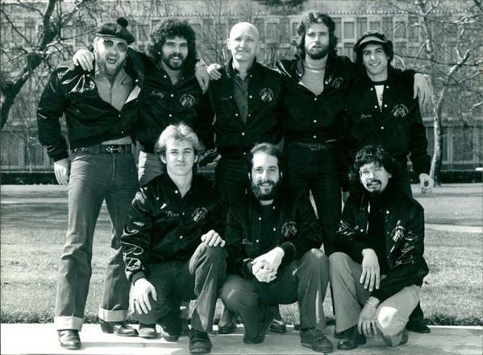

# Blood, Sweat And Tears

## Artist Profile

American jazz-rock group, formed in 1967 in New York City, New York, USA, noted for their combination of brass and rock band instrumentation. Since their beginnings, the band has gone through numerous iterations with varying personnel and has encompassed a multitude of musical styles.
1969 Grammy Awards for Album Of The Year (Blood, Sweat And Tears) and Best Contemporary Instrumental Performance ("Variations On A Theme By Eric Satie").

The band name, according to their album covers, is Blood, Sweat & Tears .

The original founding members were:
Randy Brecker - trumpet, flugelhorn (1967-1968)
Bobby Colomby - drums (1967-1977)
Jim Fielder - bass (1967-1974)
Richard Halligan - keyboards, trombone, flute (1967-1972)
Steve Katz - guitar, harmonica, lute, mandolin, vocals (1967-1973, 2008-2010)
Al Kooper - keyboards, vocals (1967-1968)
Fred Lipsius - alto sax, piano (1967-1972)
Jerry Weiss - trumpet, flugelhorn (1967-1968)

## Artist Links

- [https://bloodsweatandtears.com/](https://bloodsweatandtears.com/)
- [https://myspace.com/bloodsweatandtears1968](https://myspace.com/bloodsweatandtears1968)
- [https://www.facebook.com/BloodSweatAndTearsBand/](https://www.facebook.com/BloodSweatAndTearsBand/)
- [https://twitter.com/bsandtband](https://twitter.com/bsandtband)
- [https://www.facebook.com/groups/253708251485464/](https://www.facebook.com/groups/253708251485464/)
- [https://en.wikipedia.org/wiki/Blood,_Sweat_%26_Tears](https://en.wikipedia.org/wiki/Blood,_Sweat_%26_Tears)
- [https://web.archive.org/web/20021026091419/http://www.classicwebs.com/bs%26t.htm](https://web.archive.org/web/20021026091419/http://www.classicwebs.com/bs%26t.htm)
- [https://web.archive.org/web/20021014213224/http://www.rdrop.com/users/rickert/bst.html](https://web.archive.org/web/20021014213224/http://www.rdrop.com/users/rickert/bst.html)
- [https://web.archive.org/web/20071229055239/http://www.replay-records.net/biography/blood-sweat-tears.htm](https://web.archive.org/web/20071229055239/http://www.replay-records.net/biography/blood-sweat-tears.htm)
- [https://www.jorgenand.se/bst/bst.html](https://www.jorgenand.se/bst/bst.html)
- [http://www.rdrop.com/users/rickert/bst.html](http://www.rdrop.com/users/rickert/bst.html)
- [https://cubanbridge.wordpress.com/2017/04/21/an-unauthorized-bio-of-blood-sweat-tears-1967-2017-next-to-its-40th-touring-anniversary/](https://cubanbridge.wordpress.com/2017/04/21/an-unauthorized-bio-of-blood-sweat-tears-1967-2017-next-to-its-40th-touring-anniversary/)
- [https://musicianbio.org/blood-sweat-tears/](https://musicianbio.org/blood-sweat-tears/)
- [https://www.musicianguide.com/biographies/1608000189/Blood-Sweat-and-Tears.html](https://www.musicianguide.com/biographies/1608000189/Blood-Sweat-and-Tears.html)
- [https://www.grammy.com/grammys/artists/blood-sweat-and-tears/7131](https://www.grammy.com/grammys/artists/blood-sweat-and-tears/7131)
- [https://www.imdb.com/name/nm1513364/](https://www.imdb.com/name/nm1513364/)

## See also

- [Blood, Sweat And Tears](Blood__Sweat_And_Tears.md)
