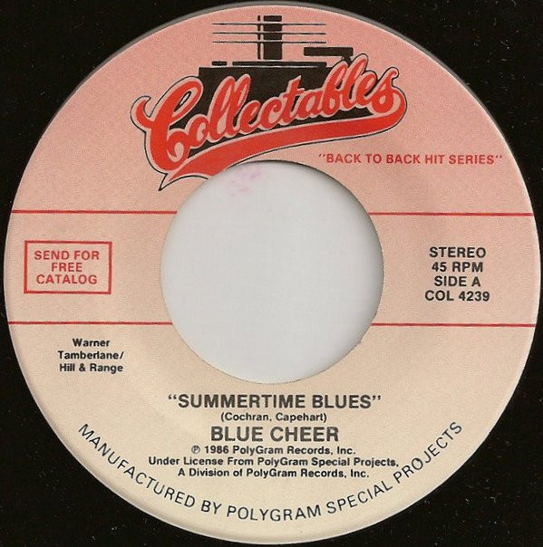

# Summertime Blues / Signs

By Blue Cheer

## Album Data

[Discogs URL](https://www.discogs.com/release/8787584-Blue-Cheer-Five-Man-Electrical-Band-Summertime-Blues-Signs)

- Label: Collectables
- Formats: Vinyl, 7", 45 RPM
- Genres: Rock, Pop Rock, Psychedelic Rock
- Rating: 3.67
- Released: 1986
- Year: 1986
- Release ID: 8787584
- Media condition: 
- Sleeve condition: 
- Speed: 
- Weight: 
- Notes: 

## Album Tracks

| **Position** | **Title** | **Duration** |
|--------------|-----------|--------------|
| A | **Summertime Blues** |  |
| B | **Signs** |  |

