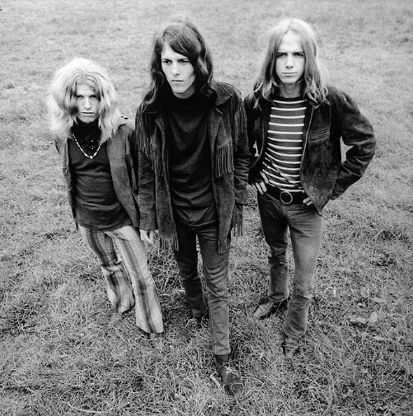

# Blue Cheer

## Artist Profile

U.S. American rock band, established in 1966 in San Francisco. Considered by some commentators to be the first heavy metal band, with particular reference to their version of "Summertime Blues."
Blue Cheer was the name of a popular laundry detergent at the time, and also a variety of potent LSD.

## Artist Links

- [http://en.wikipedia.org/wiki/Blue_Cheer](http://en.wikipedia.org/wiki/Blue_Cheer)

## See also

- [Oh! Pleasant Hope](Oh!_Pleasant_Hope.md)
- [Summertime Blues / Signs](Summertime_Blues_-_Signs.md)
