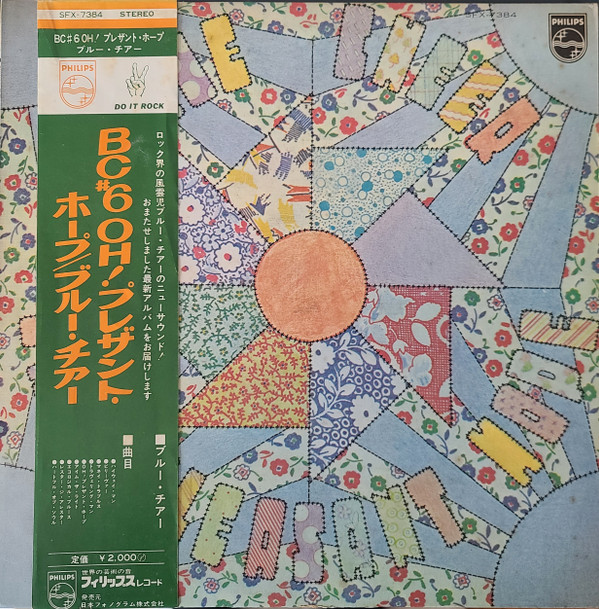

# Oh! Pleasant Hope

By Blue Cheer

## Album Data

[Discogs URL](https://www.discogs.com/release/1489054-Blue-Cheer-Oh-Pleasant-Hope)

- Label: Philips
- Formats: Vinyl, LP, Album
- Genres: Rock, Hard Rock, Folk Rock, Psychedelic Rock
- Rating: 3.93
- Released: 1971
- Year: 1971
- Release ID: 1489054
- Media condition: 
- Sleeve condition: 
- Speed: 
- Weight: 
- Notes: 

## Album Tracks

| **Position** | **Title** | **Duration** |
|--------------|-----------|--------------|
| A1 | **Hiway Man** | 4:20 |
| A2 | **Believer** | 3:55 |
| A3 | **Money Troubles** | 4:04 |
| A4 | **Traveling Man** | 3:08 |
| B1 | **Oh! Pleasant Hope** | 2:37 |
| B2 | **I'm The Light** | 5:43 |
| B3 | **Ecological Blues** | 2:23 |
| B4 | **Lester The Arrester** | 3:09 |
| B5 | **Heart Full Of Soul** | 4:38 |

## Artist Roles

| **Name** | **Role** |
|----------|----------|
| **Gary Yoder** | Acoustic Guitar, Electric Guitar, Vocals |
| **Desmond Strobel** | Art Direction |
| **Doug Killmer** | Bass |
| **Jim Keylor** | Bass |
| **John Craig (3)** | Design [Album] |
| **Kent Housman** | Dobro, Guitar, Backing Vocals |
| **Norman Mayell** | Drums, Guitar, Sitar, Vocals, Cover [Cover Concept] |
| **Mark Harman** | Engineer |
| **George Horn** | Engineer, Engineer [Remix Engineer] |
| **Dehner Patten** | Guitar |
| **Jack May** | Guitar |
| **Dr. Richard Peddicord** | Guitar, Vocals |
| **Cynthia Jobse** | Harp |
| **Ralph Burns Kellogg** | Piano, Organ, Bass |
| **Blue Cheer** | Producer |
| **Eric Albronda** | Producer |
| **Ron Stallings** | Saxophone |
| **Bob Gurland** | Trumpet [Mouth] |
| **Dickie Peterson** | Vocals, Bass |

