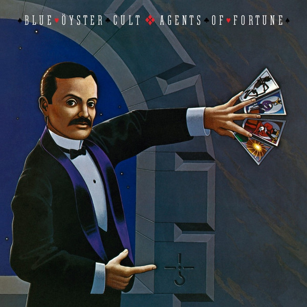

# Agents Of Fortune

By Blue Öyster Cult

## Album Data

[Discogs URL](https://www.discogs.com/release/8288086-Blue-%C3%96yster-Cult-Agents-Of-Fortune)

- Label: Friday Music
Columbia
- Formats: Vinyl, LP, Album, Limited Edition, Reissue
- Genres: Rock, Hard Rock
- Rating: 4.34
- Released: 2016-03-16
- Year: 1976
- Release ID: 8288086
- Media condition: 
- Sleeve condition: 
- Speed: 
- Weight: 
- Notes: 

## Album Tracks

| **Position** | **Title** | **Duration** |
|--------------|-----------|--------------|
| A1 | **This Ain't The Summer Of Love** | 2:20 |
| A2 | **True Confessions** | 2:55 |
| A3 | **(Don't Fear) The Reaper** | 5:05 |
| A4 | **E.T.I. (Extra Terrestrial Intelligence)** | 3:43 |
| A5 | **The Revenge Of Vera Gemini** | 3:48 |
| B1 | **Sinful Love** | 3:28 |
| B2 | **Tattoo Vampire** | 2:40 |
| B3 | **Morning Final** | 4:14 |
| B4 | **Tenderloin** | 3:53 |
| B5 | **Debbie Denise** | 4:12 |

## Artist Roles

| **Name** | **Role** |
|----------|----------|
| **Blue Öyster Cult** | Arranged By |
| **Allen Lanier** | Bass |
| **Joe Bouchard** | Bass |
| **Andy Engel** | Design [Album] |
| **John Berg** | Design [Album] |
| **Albert Bouchard** | Drums, Acoustic Guitar, Harmonica |
| **Andy Abrams** | Engineer [Recording And Mixing] |
| **Shelly Yakus** | Engineer [Recording And Mixing] |
| **Allen Lanier** | Guitar |
| **Donald "Buck Dharma" Roeser** | Guitar |
| **Eric Bloom** | Guitar |
| **Michael Brecker** | Horns |
| **Randy Brecker** | Horns |
| **Allen Lanier** | Keyboards |
| **Eric Bloom** | Keyboards |
| **Joe Reagoso** | Mastered By |
| **Tony Stevens (3)** | Mastered By |
| **Ron McMaster** | Mastered By [Vinyl] |
| **Lynn Curlee** | Painting [Cover] |
| **Albert Bouchard** | Percussion |
| **Donald "Buck Dharma" Roeser** | Percussion |
| **Eric Bloom** | Percussion |
| **Columbia Records Photo Studio** | Photography By |
| **Don Hunstein** | Photography By |
| **Joe Bouchard** | Piano |
| **David Lucas** | Producer |
| **Murray Krugman** | Producer |
| **Sandy Pearlman** | Producer |
| **Donald "Buck Dharma" Roeser** | Synthesizer |
| **Albert Bouchard** | Vocals |
| **Allen Lanier** | Vocals |
| **Donald "Buck Dharma" Roeser** | Vocals |
| **Eric Bloom** | Vocals |
| **Joe Bouchard** | Vocals |
| **Patti Smith** | Vocals |

