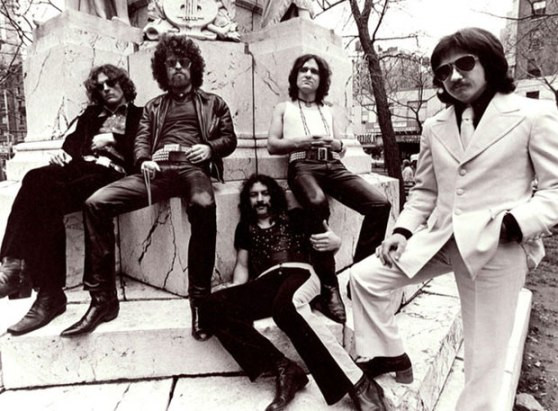

# Blue Öyster Cult

## Artist Profile

Hard Rock band from Long Island, New York (USA). 

The name Blue Öyster Cult first came into use in 1971, but the roots of the group date back to 1967 to a psychedelic group called Soft White Underbelly, which featured Albert Bouchard (drums), Allen Lanier (keyboards, guitar), Donald "Buck Dharma" Roeser (guitar), Andy Winters (bass), and Les Braunstein (vocals, AKA Les Vegas (3)) and operated under the guidance of manager/producer Sandy Pearlman. Braunstein departed in 1969 and was replaced by Eric Bloom. The band changed their name to The Stalk-Forrest group shortly after. Later, Winters was fired and replaced by Albert's younger brother, Joe. The band released their debut album in 1972. 

All the members contributed to the songwriting but lyrics were often provided by people outside of the group, including Sandy Pearlman, rock scribe Richard Meltzer, poets Patti Smith (Lanier's longtime companion) and Jim Carroll, and science fiction author Michael Moorcock, amongst others. Eric Bloom served as the band's primary lead vocalist, but Donald Roeser sang what are arguably the band's most famous songs, including "(Don't Fear) The Reaper", "Godzilla", and "Burnin' For You". The Bouchard brothers also contributed lead vocals. 

1976's "Agents Of Fortune", featuring the aforementioned "(Don't Fear) The Reaper", was the group's most successful studio album. After a commercial decline in the latter half of the 1970's, the group found renewed success with 1981's "Fire Of Unknown Origin". However, Albert Bouchard was fired after its release (he returned temporarily in 1985). The band continued but was unable to recapture their commercial fortunes. Lanier departed in 1985 and Joe Bouchard left in 1986. Lanier returned in 1987 and the band continued to tour, although they recorded very little. 2001's "Curse Of The Hidden Mirror" was the band's last studio recording until 2020's "The Symbol Remains." Roeser and Bloom continue to tour with new members (Lanier retired from the band in 2006 and passed away in 2013) .

## Artist Links

- [http://www.blueoystercult.com/](http://www.blueoystercult.com/)
- [https://myspace.com/blueoystercult](https://myspace.com/blueoystercult)
- [https://www.facebook.com/blueoystercult](https://www.facebook.com/blueoystercult)
- [https://en.wikipedia.org/wiki/Blue_%C3%96yster_Cult](https://en.wikipedia.org/wiki/Blue_%C3%96yster_Cult)

## See also

- [Agents Of Fortune](Agents_Of_Fortune.md)
- [Secret Treaties](Secret_Treaties.md)
- [Tyranny And Mutation](Tyranny_And_Mutation.md)
