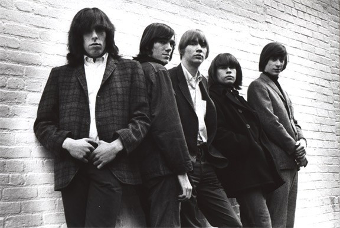

# Blues Magoos

## Artist Profile

American psychedelic and garage rock band from the Bronx, New York, best known for their hit song "(We Ain't Got) Nothin' Yet" which peaked at #5 on the Billboard Hot 100. They began in 1966 and therefore belong to the first psychedelic wave.

## Artist Links

- [http://thebluesmagoos.com/index.html](http://thebluesmagoos.com/index.html)
- [http://www.myspace.com/bluesmagoos2](http://www.myspace.com/bluesmagoos2)
- [http://en.wikipedia.org/wiki/Blues_Magoos](http://en.wikipedia.org/wiki/Blues_Magoos)

## See also

- [(We Ain't Got) Nothin' Yet](We_Aint_Got_Nothin_Yet.md)
