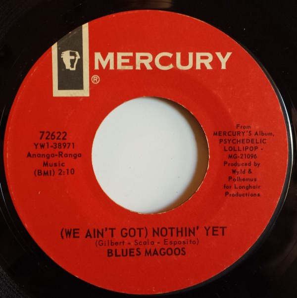

# (We Ain't Got) Nothin' Yet

By Blues Magoos

## Album Data

[Discogs URL](https://www.discogs.com/release/810379-Blues-Magoos-We-Aint-Got-Nothin-Yet)

- Label: Mercury
- Formats: Vinyl, 7", 45 RPM, Single, Styrene
- Genres: Rock, Garage Rock, Psychedelic Rock
- Rating: 4.43
- Released: 1966-10-00
- Year: 1966
- Release ID: 810379
- Media condition: 
- Sleeve condition: 
- Speed: 
- Weight: 
- Notes: 

## Album Tracks

| **Position** | **Title** | **Duration** |
|--------------|-----------|--------------|
| A | **(We Ain't Got) Nothin' Yet** | 2:10 |
| B | **Gotta Get Away** | 2:35 |

## Artist Roles

| **Name** | **Role** |
|----------|----------|
| **Art Polhemus** | Producer [Produced By] |
| **Bob Wyld** | Producer [Produced By] |

