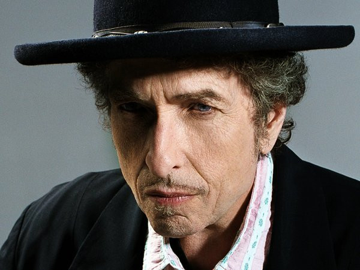

# Bob Dylan

## Artist Profile

Born: May 24, 1941, Duluth, Minnesota, USA; singer, songwriter, "song and dance man".
Inducted into Songwriters Hall of Fame in 1982 and the Rock And Roll Hall of Fame in 1988 (Performer). Winner of the 2016 Nobel Prize in literature.
His first marriage was to Sara Dylan (November 1965 - divorced June 1977), together they have five children, including Jesse Dylan and Jakob Dylan. His second marriage was to Carolyn Dennis (4 June 1986 - divorced 7 August 1990).

## Artist Links

- [http://www.bobdylan.com/](http://www.bobdylan.com/)
- [https://www.facebook.com/bobdylan/](https://www.facebook.com/bobdylan/)
- [https://twitter.com/bobdylan](https://twitter.com/bobdylan)
- [https://myspace.com/bobdylan/](https://myspace.com/bobdylan/)
- [http://www.thebobdylanfanclub.com/](http://www.thebobdylanfanclub.com/)
- [https://en.wikipedia.org/wiki/Bob_Dylan](https://en.wikipedia.org/wiki/Bob_Dylan)
- [https://www.youtube.com/channel/UCBqkojCXby4zGkWX86FEY7Q](https://www.youtube.com/channel/UCBqkojCXby4zGkWX86FEY7Q)
- [http://www.10538overture.dk/Related%20bands/Bob%20Dylan/Fronts/bob_dylan_history.html](http://www.10538overture.dk/Related%20bands/Bob%20Dylan/Fronts/bob_dylan_history.html)

## See also

- [Bridgett's Album](Bridgetts_Album.md)
- [Self Portrait](Self_Portrait.md)
