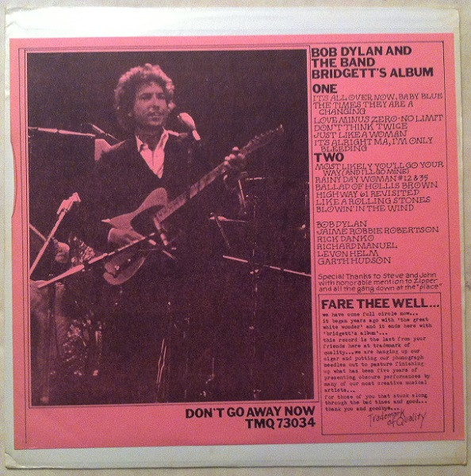

# Bridgett's Album

By Bob Dylan

## Album Data

[Discogs URL](https://www.discogs.com/release/4854809-Bob-Dylan-And-The-Band-Bridgetts-Album)

- Label: Trade Mark Of Quality
- Formats: Vinyl, LP, Unofficial Release
- Genres: Rock, Folk Rock
- Rating: 4.33
- Released: 1974
- Year: 1974
- Release ID: 4854809
- Media condition: 
- Sleeve condition: 
- Speed: 
- Weight: 
- Notes: 

## Album Tracks

| **Position** | **Title** | **Duration** |
|--------------|-----------|--------------|
| A1 | **It's All Over Now, Baby Blue** |  |
| A2 | **The Times They Are A Changing** |  |
| A3 | **Love Minus Zero - No Limit** |  |
| A4 | **Don't Think Twice** |  |
| A5 | **Just Like A Woman** |  |
| A6 | **It's Alright Ma, I'm Only Bleeding** |  |
| B1 | **Most Likely You'll Go Your Way (And I'll Go Mine)** |  |
| B2 | **Rainy Day Woman #12 & 35** |  |
| B3 | **Ballad Of Hollis Brown** |  |
| B4 | **Highway 61 Revisited** |  |
| B5 | **Like A Rolling Stone** |  |
| B6 | **Blowin' In The Wind** |  |

