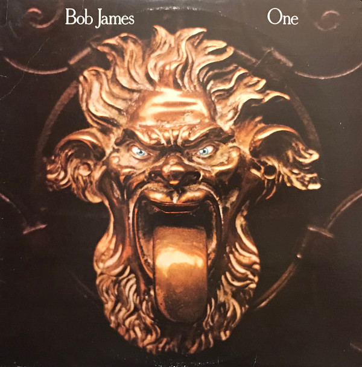

# One

By Bob James

## Album Data

[Discogs URL](https://www.discogs.com/release/317028-Bob-James-One)

- Label: CTI Records
- Formats: Vinyl, LP, Album
- Genres: Jazz, Fusion, Jazz-Funk, Contemporary Jazz
- Rating: 4.5
- Released: 1974
- Year: 1974
- Release ID: 317028
- Media condition: 
- Sleeve condition: 
- Speed: 
- Weight: 
- Notes: 

## Album Tracks

| **Position** | **Title** | **Duration** |
|--------------|-----------|--------------|
| A1 | **Valley Of The Shadows** | 9:42 |
| A2 | **In The Garden** | 3:06 |
| A3 | **Soulero** | 3:22 |
| B1 | **Night On Bald Mountain** | 5:51 |
| B2 | **Feel Like Making Love** | 6:40 |
| B3 | **Nautilus** | 5:08 |

## Artist Roles

| **Name** | **Role** |
|----------|----------|
| **George Marge** | Alto Flute, Recorder |
| **Romeo Penque** | Alto Flute, Recorder |
| **Bob James** | Arranged By, Conductor |
| **Gary King** | Bass |
| **Alan Raph** | Bass Trombone |
| **Jack Gale** | Bass Trombone |
| **Paul Faulise** | Bass Trombone |
| **Alan Shulman** | Cello |
| **Anthony Sophos** | Cello |
| **Charles McCracken** | Cello |
| **George Ricci** | Cello |
| **Jesse Levy** | Cello |
| **Seymour Barab** | Cello |
| **Bob Ciano** | Design [Album Design] |
| **Idris Muhammad** | Drums |
| **Steve Gadd** | Drums |
| **Rudy Van Gelder** | Engineer |
| **Jon Faddis** | Flugelhorn |
| **Thad Jones** | Flugelhorn |
| **Richard Resnicoff** | Guitar |
| **Bob James** | Keyboards |
| **Rudy Van Gelder** | Lacquer Cut By |
| **Ralph MacDonald** | Percussion |
| **Gene Laurents** | Photography By [Cover] |
| **Creed Taylor** | Producer |
| **Wayne Andre** | Trombone |
| **Alan Rubin** | Trumpet |
| **Jon Faddis** | Trumpet |
| **Lew Soloff** | Trumpet |
| **Marvin Stamm** | Trumpet |
| **Thad Jones** | Trumpet |
| **Victor Paz** | Trumpet |
| **David Friedman** | Vibraphone |
| **Charles Libove** | Violin |
| **David Nadien** | Violin |
| **Emanuel Green** | Violin |
| **Gene Orloff** | Violin |
| **Harold Kohon** | Violin |
| **Harry Lookofsky** | Violin |
| **Joe Malin** | Violin |
| **Max Ellen** | Violin |
| **Paul Gershman** | Violin |

