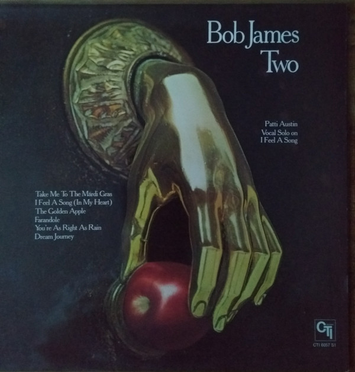

# Two

By Bob James

## Album Data

[Discogs URL](https://www.discogs.com/release/609588-Bob-James-Two)

- Label: CTI Records
- Formats: Vinyl, LP, Album, Stereo
- Genres: Jazz, Fusion, Jazz-Funk
- Rating: 4.27
- Released: 1975
- Year: 1975
- Release ID: 609588
- Media condition: 
- Sleeve condition: 
- Speed: 
- Weight: 
- Notes: 

## Album Tracks

| **Position** | **Title** | **Duration** |
|--------------|-----------|--------------|
| A1 | **Take Me To The Mardi Gras** | 5:50 |
| A2 | **I Feel A Song (In My Heart)** | 5:26 |
| A3 | **The Golden Apple** | 7:20 |
| B1 | **Farandole** | 8:24 |
| B2 | **You're As Right As Rain** | 5:29 |
| B3 | **Dream Journey** | 5:57 |

## Artist Roles

| **Name** | **Role** |
|----------|----------|
| **Bob James** | Arranged By, Conductor |
| **Eric Gale** | Bass |
| **Alan Shulman** | Cello |
| **Alla Goldberg** | Cello |
| **Anthony Sophos** | Cello |
| **George Ricci** | Cello |
| **Jesse Levy** | Cello |
| **Seymour Barab** | Cello |
| **Warren Lash** | Cello |
| **Eddie Daniels** | Clarinet |
| **Bob Ciano** | Design [Album] |
| **Andrew Smith (4)** | Drums |
| **Bob James** | Electric Piano, Clavinet, Synthesizer [Arp Odyssey], Organ [Yamaha Yc30] |
| **Rudy Van Gelder** | Engineer |
| **Al Richmond** | French Horn |
| **Jim Buffington** | French Horn |
| **Peter Gordon (8)** | French Horn |
| **Eric Gale** | Guitar |
| **Richard Resnicoff** | Guitar |
| **Rudy Van Gelder** | Lacquer Cut By |
| **Arthur Jenkins** | Percussion |
| **Ralph MacDonald** | Percussion |
| **Gene Laurents** | Photography By [Cover] |
| **Creed Taylor** | Producer |
| **Eddie Bert** | Trombone |
| **Thomas Mitchell** | Trombone |
| **Tony Studd** | Trombone |
| **Wayne Andre** | Trombone |
| **John Frosk** | Trumpet, Flugelhorn |
| **Lew Soloff** | Trumpet, Flugelhorn |
| **Marvin Stamm** | Trumpet, Flugelhorn |
| **Randy Brecker** | Trumpet, Flugelhorn |
| **Victor Paz** | Trumpet, Flugelhorn |
| **Charles Libove** | Violin |
| **David Nadien** | Violin |
| **Emanuel Green** | Violin |
| **Gene Orloff** | Violin |
| **Harold Kohon** | Violin |
| **Harry Cykman** | Violin |
| **Harry Glickman** | Violin |
| **Harry Lookofsky** | Violin |
| **Joe Malin** | Violin |
| **Matthew Raimondi** | Violin |
| **Max Ellen** | Violin |
| **Paul Gershman** | Violin |
| **Frank Floyd** | Vocals [Group] |
| **Lani Groves** | Vocals [Group] |
| **Patti Austin** | Vocals [Group] |
| **Zachary Sanders** | Vocals [Group] |

