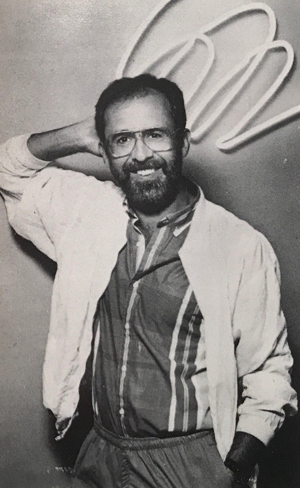

# Bob James

## Artist Profile

American keyboardist, singer, songwriter, producer and music arranger. He was born December 25, 1939 in Marshall, Missouri. Father of singer / songwriter Hilary James.

## Artist Links

- [http://www.bobjames.com/](http://www.bobjames.com/)
- [https://fourplayjazz.com/?page_id=211](https://fourplayjazz.com/?page_id=211)
- [https://www.facebook.com/BobJamesJazz](https://www.facebook.com/BobJamesJazz)
- [https://myspace.com/bobjamesjazz](https://myspace.com/bobjamesjazz)
- [https://myspace.com/bobjamescountry](https://myspace.com/bobjamescountry)
- [https://twitter.com/bobjamesmusic](https://twitter.com/bobjamesmusic)
- [http://www.whosampled.com/Bob-James/](http://www.whosampled.com/Bob-James/)
- [http://en.wikipedia.org/wiki/Bob_James_%28musician%29](http://en.wikipedia.org/wiki/Bob_James_%28musician%29)
- [http://repertoire.bmi.com/Catalog.aspx?detail=writerid&page=1&fromrow=1&torow=25&keyid=169616&subid=0](http://repertoire.bmi.com/Catalog.aspx?detail=writerid&page=1&fromrow=1&torow=25&keyid=169616&subid=0)
- [https://www.ascap.com/repertory#ace/writer/34494089/JAMES%20ROBERT%20M](https://www.ascap.com/repertory#ace/writer/34494089/JAMES%20ROBERT%20M)

## See also

- [One](One.md)
- [Three](Three.md)
- [Two](Two.md)
