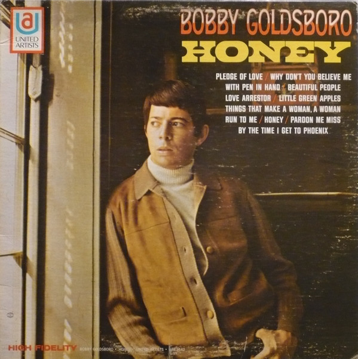

# Honey

By Bobby Goldsboro

## Album Data

[Discogs URL](https://www.discogs.com/release/1532125-Bobby-Goldsboro-Honey)

- Label: United Artists Records
- Formats: Vinyl, LP, Album, Stereo
- Genres: Pop, Vocal
- Rating: 3.58
- Released: 1968
- Year: 1968
- Release ID: 1532125
- Media condition: 
- Sleeve condition: 
- Speed: 
- Weight: 
- Notes: 

## Album Tracks

| **Position** | **Title** | **Duration** |
|--------------|-----------|--------------|
| A1 | **Honey** | 3:58 |
| A2 | **Run To Me** | 2:25 |
| A3 | **With Pen In Hand** | 3:27 |
| A4 | **Pardon Me Miss** | 2:40 |
| A5 | **Why Don't You Believe Me** | 2:15 |
| B1 | **Pledge Of Love** | 2:21 |
| B2 | **Little Green Apples** | 2:25 |
| B3 | **Love Arrestor** | 2:43 |
| B4 | **By The Time I Get To Phoenix** | 2:44 |
| B5 | **Beautiful People** | 2:20 |
| B6 | **A Woman** | 2:11 |

## Artist Roles

| **Name** | **Role** |
|----------|----------|
| **Bill Justis** | Arranged By |
| **Don Tweedy** | Arranged By |
| **Ray Stevens** | Arranged By |
| **Bob Montgomery** | Producer |
| **Jack Gold** | Producer |

