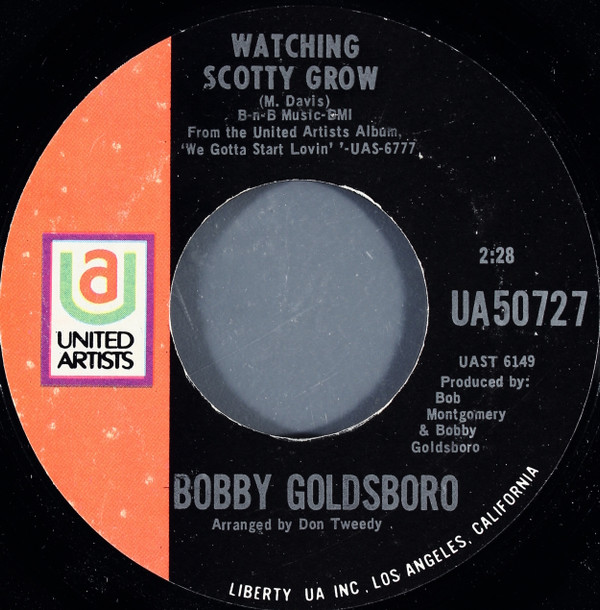

# Watching Scotty Grow / Water Color Days

By Bobby Goldsboro

## Album Data

[Discogs URL](https://www.discogs.com/release/4893720-Bobby-Goldsboro-Watching-Scotty-Grow-Water-Color-Days)

- Label: United Artists Records
- Formats: Vinyl, 7", 45 RPM, Single, Styrene
- Genres: Rock, Pop Rock
- Rating: 4.25
- Released: 1970-11-20
- Year: 1970
- Release ID: 4893720
- Media condition: 
- Sleeve condition: 
- Speed: 
- Weight: 
- Notes: 

## Album Tracks

| **Position** | **Title** | **Duration** |
|--------------|-----------|--------------|
| A | **Watching Scotty Grow** | 2:28 |
| B | **Water Color Days** | 2:45 |

## Artist Roles

| **Name** | **Role** |
|----------|----------|
| **Don Tweedy** | Arranged By |
| **Bob Montgomery** | Producer |
| **Bobby Goldsboro** | Producer |

