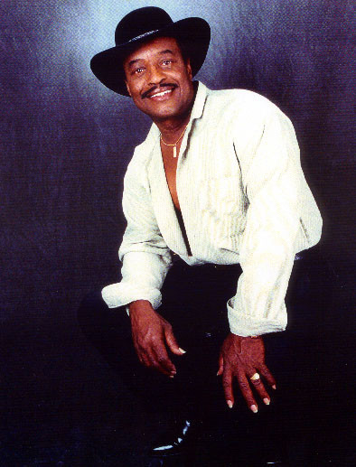

# Bobby Hendricks

## Artist Profile

Bobby Hendricks (born February 22, 1938, Columbus, Ohio, died March 25, 2022 Lancaster, California age 84) was an American R&B singer who charted two hits in the late 1950s. Hendricks was a member of The Swallows, The Flyers, and sang lead with The Drifters before becoming a successful solo act

## Artist Links

## See also

- [Itchy Twitchy Feeling / Psycho](Itchy_Twitchy_Feeling_-_Psycho.md)
