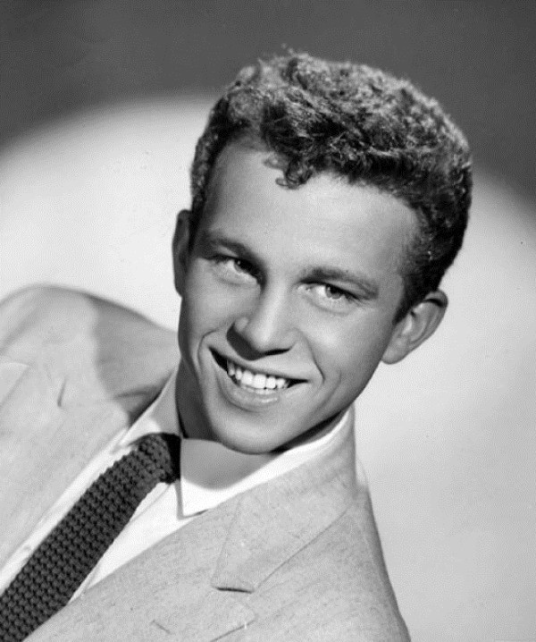

# Bobby Vinton

## Artist Profile

American pop music singer, born on April 16, 1935, in Canonsburg, Pennsylvania.

## Artist Links

- [http://www.bobbyvinton.com/](http://www.bobbyvinton.com/)
- [http://en.wikipedia.org/wiki/Bobby_Vinton](http://en.wikipedia.org/wiki/Bobby_Vinton)
- [https://www.imdb.com/name/nm0899130/](https://www.imdb.com/name/nm0899130/)

## See also

- [Mr. Lonely / It's Better To Have Loved](Mr_Lonely_-_Its_Better_To_Have_Loved.md)
