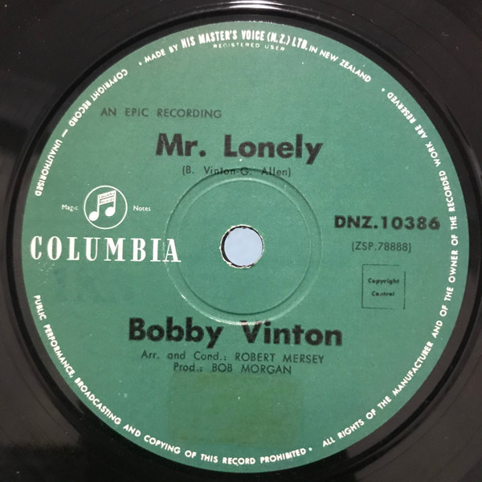

# Mr. Lonely / It's Better To Have Loved

By Bobby Vinton

## Album Data

[Discogs URL](https://www.discogs.com/release/6474810-Bobby-Vinton-Mr-Lonely-Its-Better-To-Have-Loved)

- Label: Epic
- Formats: Vinyl, 7", 45 RPM, Single
- Genres: Pop, Vocal
- Rating: 3.65
- Released: 1964
- Year: 1964
- Release ID: 6474810
- Media condition: 
- Sleeve condition: 
- Speed: 
- Weight: 
- Notes: 

## Album Tracks

| **Position** | **Title** | **Duration** |
|--------------|-----------|--------------|
| A | **Mr. Lonely** |  |
| B | **It's Better To Have Loved** |  |

## Artist Roles

| **Name** | **Role** |
|----------|----------|
| **Bob Morgan (2)** | Producer |
| **Bobby Vinton** | Written-By |

