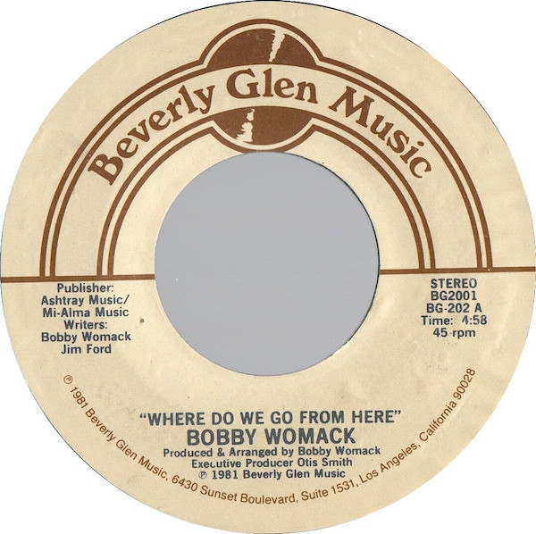

# Where Do We Go From Here

By Bobby Womack

## Album Data

[Discogs URL](https://www.discogs.com/release/2269858-Bobby-Womack-Where-Do-We-Go-From-Here)

- Label: Beverly Glen Music
- Formats: Vinyl, 7", 45 RPM, Styrene, Stereo
- Genres: Funk / Soul, Soul
- Rating: 4.17
- Released: 1981
- Year: 1981
- Release ID: 2269858
- Media condition: 
- Sleeve condition: 
- Speed: 
- Weight: 
- Notes: 

## Album Tracks

| **Position** | **Title** | **Duration** |
|--------------|-----------|--------------|
| A | **Where Do We Go From Here** | 4:58 |
| B | **Just My Imagination** | 5:09 |

## Artist Roles

| **Name** | **Role** |
|----------|----------|
| **Bobby Womack** | Arranged By, Producer |
| **Otis Smith** | Executive-Producer |

