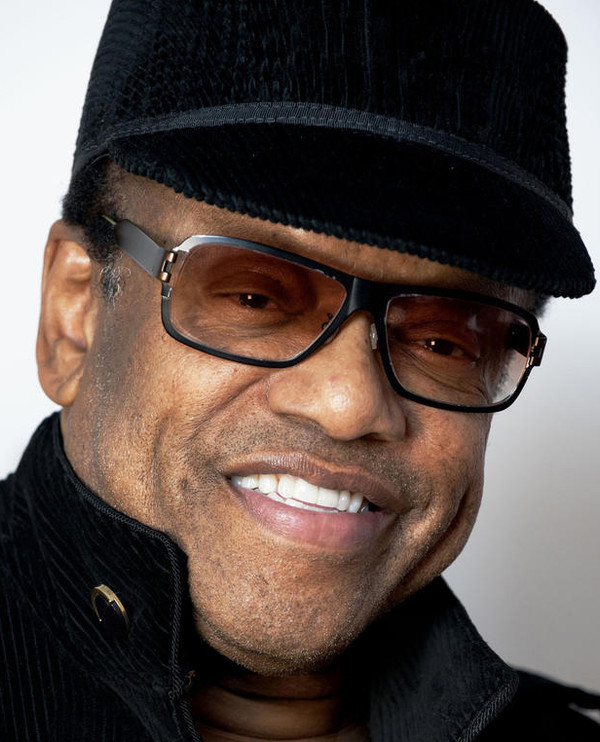

# Bobby Womack

## Artist Profile

Singer, guitarist and songwriter
Born on 4 March 1944 in Cleveland, Ohio, USA. 
Died on 27 June 2014 in Tarzana, California, USA.
Formed the The Womack Brothers gospel quintet with his brothers Cecil, Curtis, Friendly and Harry in the early 1950s. Produced by Sam Cooke from 1953 on, they moved to secular music and the band was renamed Valentinos. Soon after the death of Sam Cooke in 1964, Bobby Womack embarked on a successful solo career as a songwriter, session guitarist and recording artist. Inducted into Rock And Roll Hall of Fame in 2009 (Performer).

## Artist Links

- [http://bobbywomack.com](http://bobbywomack.com)
- [http://www.womagic.de/](http://www.womagic.de/)
- [http://www.facebook.com/OfficialBobbyWomack](http://www.facebook.com/OfficialBobbyWomack)
- [http://genius.com/artists/Bobby-womack](http://genius.com/artists/Bobby-womack)
- [http://www.imdb.com/name/nm0938810](http://www.imdb.com/name/nm0938810)
- 
- [http://myspace.com/bobbywomack](http://myspace.com/bobbywomack)
- [http://twitter.com/RealBobbyWomack](http://twitter.com/RealBobbyWomack)
- 
- [http://www.whosampled.com/Bobby-Womack](http://www.whosampled.com/Bobby-Womack)
- [http://en.wikipedia.org/wiki/Bobby_Womack](http://en.wikipedia.org/wiki/Bobby_Womack)
- [http://www.youtube.com/channel/UCLoWsv7bSwgM-_vkC22f4Ag](http://www.youtube.com/channel/UCLoWsv7bSwgM-_vkC22f4Ag)
- [http://www.youtube.com/user/BobbyWomackVEVO](http://www.youtube.com/user/BobbyWomackVEVO)
- [http://www.youtube.com/playlist?list=PLolpS5_RQGRHWOxWnPhcy6aN-dkwBBINK](http://www.youtube.com/playlist?list=PLolpS5_RQGRHWOxWnPhcy6aN-dkwBBINK)

## See also

- [Where Do We Go From Here](Where_Do_We_Go_From_Here.md)
