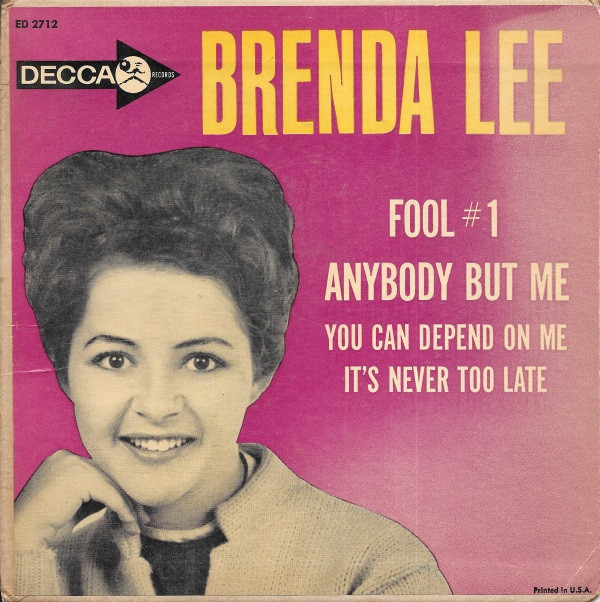

# Brenda Lee

By Brenda Lee

## Album Data

[Discogs URL](https://www.discogs.com/release/9729611-Brenda-Lee-Brenda-Lee)

- Label: Decca
- Formats: Vinyl, 7", 45 RPM, EP
- Genres: Folk, World, & Country, Country
- Rating: 0
- Released: 1961
- Year: 1961
- Release ID: 9729611
- Media condition: 
- Sleeve condition: 
- Speed: 
- Weight: 
- Notes: 

## Album Tracks

| **Position** | **Title** | **Duration** |
|--------------|-----------|--------------|
| A1 | **Fool #1** |  |
| A2 | **Anybody But Me** |  |
| B1 | **You Can Depend On Me** |  |
| B2 | **It's Never Too Late** |  |

