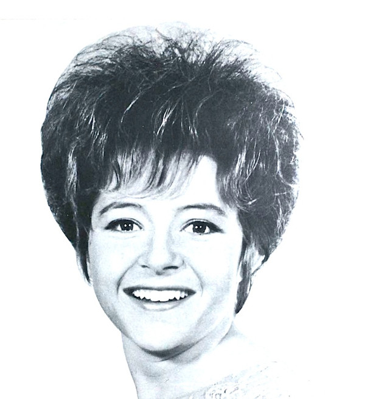

# Brenda Lee

## Artist Profile

American performer who sang rockabilly, pop and country music, born December 11, 1944 in Atlanta, Georgia, USA.

Inducted into Rock And Roll Hall of Fame in 2002 (Performer).

Married to Ronnie Shacklett.

## Artist Links

- [http://www.brendalee.com](http://www.brendalee.com)
- [http://en.wikipedia.org/wiki/Brenda_Lee](http://en.wikipedia.org/wiki/Brenda_Lee)

## See also

- [Brenda Lee](Brenda_Lee.md)
- [I'm Sorry](Im_Sorry.md)
