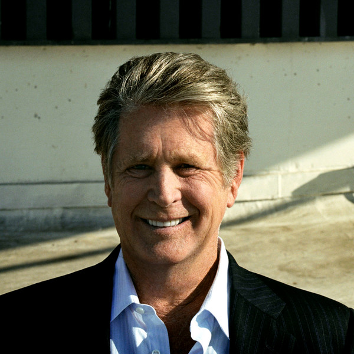

# Brian Wilson

## Artist Profile

American songwriter, producer, arranger and musician, co-founder and leader of The Beach Boys. Born 20 June 1942 in Inglewood, California, USA. From late 1964 to 1979, Wilson was married to Marilyn Rovell, with whom he had daughters Carnie and Wendy who became members of both The Wilsons and Wilson Phillips. Son of Murry Wilson and Audree Wilson. Brother of Dennis Wilson (2) and Carl Wilson and cousin of Mike Love.

## Artist Links

- [https://www.brianwilson.com/](https://www.brianwilson.com/)
- [https://en.wikipedia.org/wiki/Brian_Wilson](https://en.wikipedia.org/wiki/Brian_Wilson)
- [https://soundcloud.com/brianwilsonmusic](https://soundcloud.com/brianwilsonmusic)
- [https://www.youtube.com/user/brianwilsonlive](https://www.youtube.com/user/brianwilsonlive)
- [https://twitter.com/BrianWilsonLive](https://twitter.com/BrianWilsonLive)
- [https://www.facebook.com/officialbrianwilson](https://www.facebook.com/officialbrianwilson)
- [https://www.instagram.com/brianwilsonlive/](https://www.instagram.com/brianwilsonlive/)
- [https://www.imdb.com/name/nm0933092/](https://www.imdb.com/name/nm0933092/)

## See also

- [Brian Wilson](Brian_Wilson.md)
