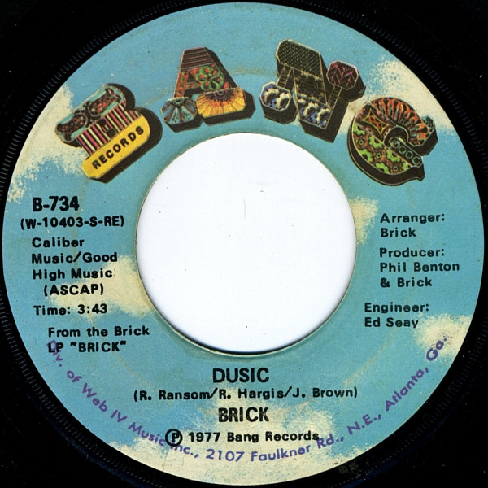

# Dusic / Happy

By Brick

## Album Data

[Discogs URL](https://www.discogs.com/release/5411886-Brick-Dusic-Happy)

- Label: Bang Records
- Formats: Vinyl, 7", 45 RPM, Single
- Genres: Funk / Soul, Funk, Disco
- Rating: 4.33
- Released: 1977
- Year: 1977
- Release ID: 5411886
- Media condition: 
- Sleeve condition: 
- Speed: 
- Weight: 
- Notes: 

## Album Tracks

| **Position** | **Title** | **Duration** |
|--------------|-----------|--------------|
| A | **Dusic** | 3:43 |
| B | **Happy** | 4:20 |

## Artist Roles

| **Name** | **Role** |
|----------|----------|
| **Brick** | Arranged By |
| **Ed Seay** | Engineer |
| **Brick** | Producer |
| **Phil Benton** | Producer |

