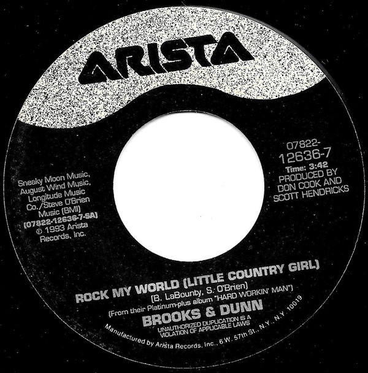

# Rock My World (Little Country Girl)

By Brooks & Dunn

## Album Data

[Discogs URL](https://www.discogs.com/release/3886900-Brooks-Dunn-Rock-My-World-Little-Country-Girl)

- Label: Arista
- Formats: Vinyl, 7", 45 RPM, Single
- Genres: Folk, World, & Country, Country
- Rating: 4.25
- Released: 1993
- Year: 1993
- Release ID: 3886900
- Media condition: 
- Sleeve condition: 
- Speed: 
- Weight: 
- Notes: 

## Album Tracks

| **Position** | **Title** | **Duration** |
|--------------|-----------|--------------|
| A | **Rock My World (Little Country Girl)** | 3:42 |
| B | **Our Time Is Coming** | 4:37 |

