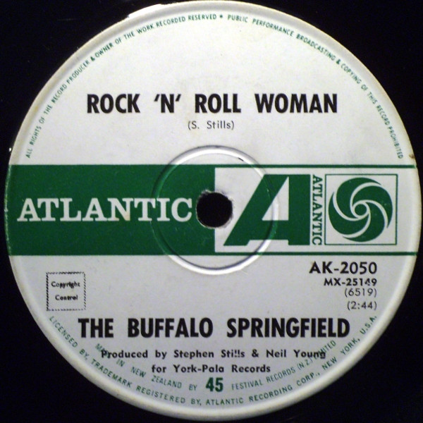

# Rock 'N' Roll Woman / A Child's Claim To Fame

By Buffalo Springfield

## Album Data

[Discogs URL](https://www.discogs.com/release/1527561-The-Buffalo-Springfield-Rock-N-Roll-Woman-A-Childs-Claim-To-Fame)

- Label: ATCO Records
- Formats: Vinyl, 7", 45 RPM, Single
- Genres: Rock, Classic Rock, Folk Rock
- Rating: 4
- Released: 1967
- Year: 1967
- Release ID: 1527561
- Media condition: 
- Sleeve condition: 
- Speed: 
- Weight: 
- Notes: 

## Album Tracks

| **Position** | **Title** | **Duration** |
|--------------|-----------|--------------|
| A | **Rock 'N' Roll Woman** | 2:44 |
| B | **A Child's Claim To Fame** | 2:10 |

