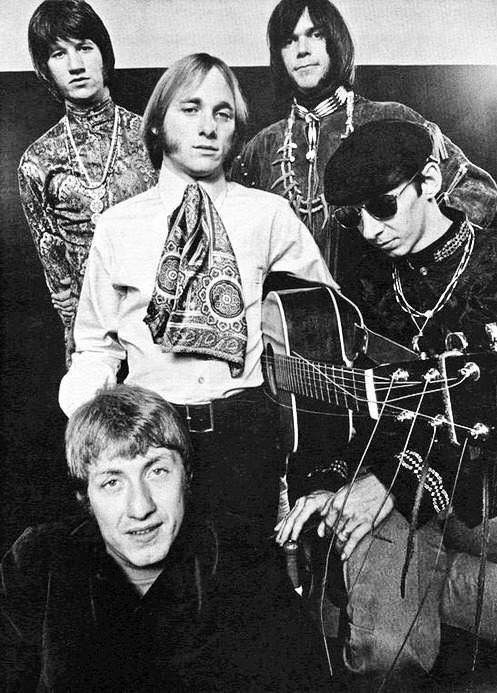

# Buffalo Springfield

## Artist Profile

American folk rock band founded in 1966 in Los Angeles and formally disbanded in 1968 after releasing three studio albums. Prominent members included Neil Young, Stephen Stills and Richie Furay. Inducted into Rock And Roll Hall of Fame in 1997 (Performer).

## Artist Links

- [https://en.wikipedia.org/wiki/Buffalo_Springfield](https://en.wikipedia.org/wiki/Buffalo_Springfield)

## See also

- [Last Time Around](Last_Time_Around.md)
- [Rock 'N' Roll Woman / A Child's Claim To Fame](Rock_N_Roll_Woman_-_A_Childs_Claim_To_Fame.md)
