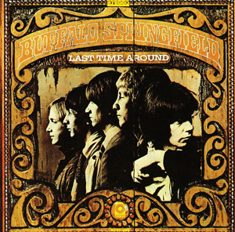

# Last Time Around

By Buffalo Springfield

## Album Data

[Discogs URL](https://www.discogs.com/release/3903910-Buffalo-Springfield-Last-Time-Around)

- Label: ATCO Records
- Formats: Vinyl, LP, Album
- Genres: Rock, Pop, Folk, World, & Country, Folk Rock, Country Rock, Psychedelic Rock
- Rating: 3.89
- Released: 1968
- Year: 1968
- Release ID: 3903910
- Media condition: 
- Sleeve condition: 
- Speed: 
- Weight: 
- Notes: 

## Album Tracks

| **Position** | **Title** | **Duration** |
|--------------|-----------|--------------|
| A1 | **On The Way Home** | 2:25 |
| A2 | **It's So Hard To Wait** | 2:03 |
| A3 | **Pretty Girl Why** | 2:24 |
| A4 | **Four Days Gone** | 2:53 |
| A5 | **Carefree Country Day** | 2:35 |
| A6 | **Special Care** | 3:30 |
| B1 | **The Hour Of Not Quite Rain** | 3:45 |
| B2 | **Questions** | 2:52 |
| B3 | **I Am A Child** | 2:15 |
| B4 | **Merry-Go-Round** | 2:02 |
| B5 | **Uno Mundo** | 2:00 |
| B6 | **Kind Woman** | 4:10 |

## Artist Roles

| **Name** | **Role** |
|----------|----------|
| **Derinda Christiansen** | Artwork [Backliner] |
| **Jimini Productions** | Artwork [Cover] |
| **Adrian Barber** | Engineer |
| **Jim Messina** | Engineer |
| **Phil Iehle** | Engineer |
| **Jim Messina** | Producer |
| **Jim Messina** | Vocals [Lead] |
| **Neil Young** | Vocals [Lead] |
| **Richie Furay** | Vocals [Lead] |
| **Stephen Stills** | Vocals [Lead] |
| **Jim Messina** | Written-By |
| **Micki Callen** | Written-By |
| **Neil Young** | Written-By |
| **Richie Furay** | Written-By |
| **Stephen Stills** | Written-By |

