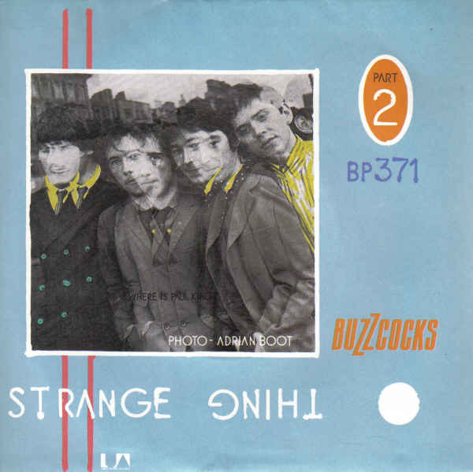

# Strange Thing

By Buzzcocks

## Album Data

[Discogs URL](https://www.discogs.com/release/464676-Buzzcocks-Strange-Thing)

- Label: United Artists Records
- Formats: Vinyl, 7", 45 RPM
- Genres: Rock, New Wave
- Rating: 4.07
- Released: 1980-10-13
- Year: 1980
- Release ID: 464676
- Media condition: 
- Sleeve condition: 
- Speed: 
- Weight: 
- Notes: 

## Album Tracks

| **Position** | **Title** | **Duration** |
|--------------|-----------|--------------|
| A | **Strange Thing** | 4:08 |
| B | **Airwaves Dream** | 3:51 |

## Artist Roles

| **Name** | **Role** |
|----------|----------|
| **Porky (5)** | Mastered By |
| **Adrian Boot** | Photography By [Band Photo On Strange Thing Side Of Sleeve] |
| **Martin Hannett** | Producer |

