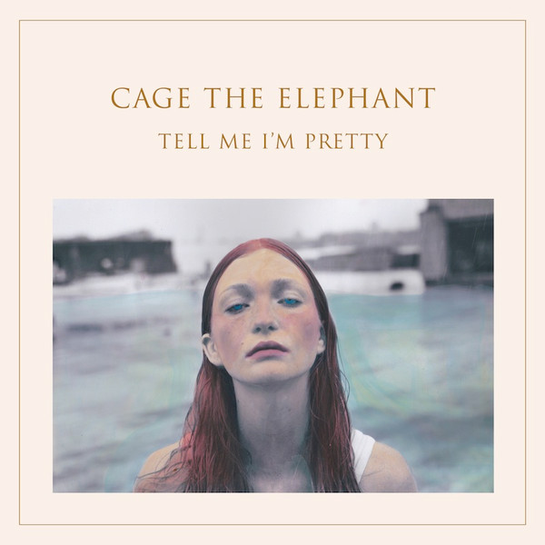

# Tell Me I'm Pretty

By Cage The Elephant

## Album Data

[Discogs URL](https://www.discogs.com/release/7856486-Cage-The-Elephant-Tell-Me-Im-Pretty)

- Label: RCA
DSP (4)
- Formats: Vinyl, LP, Album
- Genres: Rock, Alternative Rock
- Rating: 4.3
- Released: 2015-12-18
- Year: 2015
- Release ID: 7856486
- Media condition: 
- Sleeve condition: 
- Speed: 
- Weight: 
- Notes: 

## Album Tracks

| **Position** | **Title** | **Duration** |
|--------------|-----------|--------------|
| A1 | **Cry Baby** | 4:07 |
| A2 | **Mess Around** | 2:53 |
| A3 | **Sweetie Little Jean** | 3:45 |
| A4 | **Too Late To Say Goodbye** | 4:13 |
| A5 | **Cold Cold Cold** | 3:34 |
| B1 | **Trouble** | 3:46 |
| B2 | **How Are You True** | 4:41 |
| B3 | **That's Right** | 3:53 |
| B4 | **Punchin' Bag** | 3:51 |
| B5 | **Portuguese Knife Fight** | 3:38 |

## Artist Roles

| **Name** | **Role** |
|----------|----------|
| **David J. Wolter** | A&R |
| **Dan Auerbach** | Arranged By |
| **Meghan Foley** | Art Direction |
| **Daniel Tichenor** | Bass |
| **Juliette Buchs Shultz** | Design [Additional], Photography [Additional] |
| **Kane Stewart** | Design [Senior Graphic Design Artist] |
| **Jared Champion** | Drums |
| **Collin Dupuis** | Engineer |
| **Brad Shultz** | Guitar |
| **Dan Auerbach** | Guitar [Additional], Backing Vocals, Keyboards, Producer |
| **Nick Bockrath** | Guitar, Backing Vocals |
| **Matthan Minster** | Keyboards, Backing Vocals, Percussion |
| **Q Prime Inc.** | Management |
| **Brian Lacey** | Mastered By |
| **Chris Bellman** | Mastered By [Vinyl] |
| **Tom Elmhirst** | Mixed By |
| **Moses Moreno** | Other [Styling] |
| **Ira Chernova** | Photography By |
| **Emily Davis (8)** | Photography [Hand Tinting] |
| **Danny Tomczak** | Producer [Assistant] |
| **Matt Shultz (2)** | Vocals, Acoustic Guitar, Art Direction |
| **Cage The Elephant** | Written-By |

