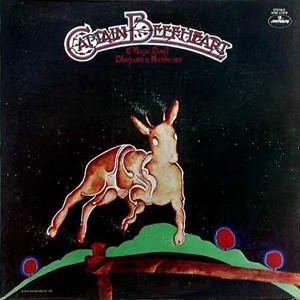

# Bluejeans & Moonbeams

By Captain Beefheart

## Album Data

[Discogs URL](https://www.discogs.com/release/1430388-Captain-Beefheart-And-The-Magic-Band-Bluejeans-Moonbeams)

- Label: Mercury
- Formats: Vinyl, LP, Album, Reissue
- Genres: Rock, Blues Rock
- Rating: 4.48
- Released: 2000
- Year: 1974
- Release ID: 1430388
- Media condition: 
- Sleeve condition: 
- Speed: 
- Weight: 
- Notes: 

## Album Tracks

| **Position** | **Title** | **Duration** |
|--------------|-----------|--------------|
| A1 | **Party Of Special Things To Do** | 2:49 |
| A2 | **Same Old Blues** | 4:00 |
| A3 | **Observatory Crest** | 3:33 |
| A4 | **Pompadour Swamp** | 3:33 |
| A5 | **Captains Holiday** | 5:43 |
| B1 | **Rock 'N Roll's Evil Doll** | 3:20 |
| B2 | **Further Than We've Gone** | 5:32 |
| B3 | **Twist Ah Luck** | 3:23 |
| B4 | **Bluejeans And Moonbeams** | 5:02 |

## Artist Roles

| **Name** | **Role** |
|----------|----------|
| **Ira Ingber** | Bass |
| **Gene Pello** | Drums |
| **Greg Ladanyi** | Engineer |
| **Jimmy Caravan** | Keyboards |
| **Mark Gibbons** | Keyboards |
| **Micheal Smotherman** | Keyboards, Backing Vocals |
| **Ty Grimes** | Percussion |
| **Andy Di Martino** | Producer |
| **Dean Smith** | Slide Guitar |
| **Don Van Vliet** | Vocals, Harmonica |

