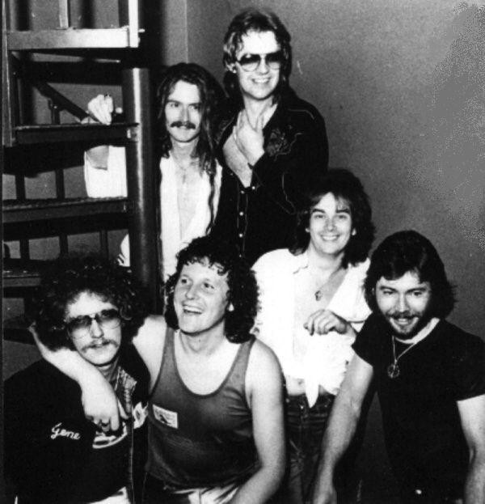

# Charlie

## Artist Profile

Charlie is an AOR/hard rock band from London, England, Great Britain, that was formed in 1971 under the name Charlie Cuckoo. The band split up for the first time in 1986, was reformed in 2009 and split up again in 2015.

## Artist Links

- [http://www.charlie-music.com/](http://www.charlie-music.com/)
- [https://www.charlietheband.activeboard.com/](https://www.charlietheband.activeboard.com/)
- [https://en.wikipedia.org/wiki/Charlie_(band)](https://en.wikipedia.org/wiki/Charlie_(band))

## See also

- [Lines](Lines.md)
