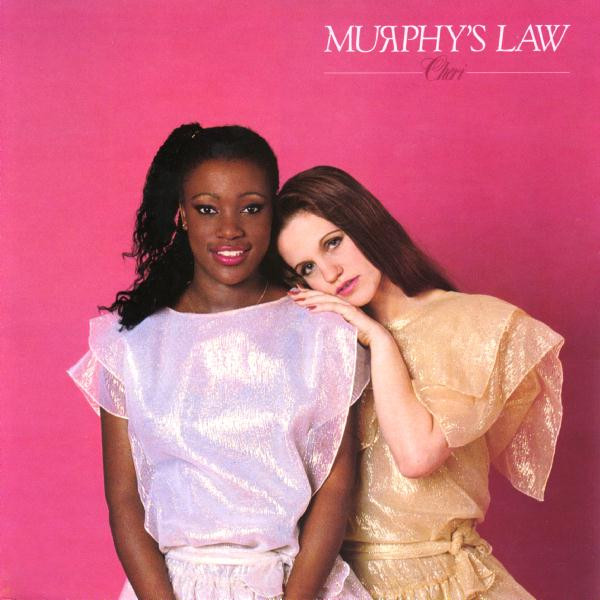

# Murphy's Law

By Cheri

## Album Data

[Discogs URL](https://www.discogs.com/release/2602914-Cheri-Murphys-Law)

- Label: Venture Records
- Formats: Vinyl, 7", 45 RPM, Single, Stereo
- Genres: Electronic, Funk / Soul, Funk, Disco
- Rating: 4.67
- Released: 1982
- Year: 1982
- Release ID: 2602914
- Media condition: 
- Sleeve condition: 
- Speed: 
- Weight: 
- Notes: 

## Album Tracks

| **Position** | **Title** | **Duration** |
|--------------|-----------|--------------|
| A | **Murphy's Law (Remix)** | 3:53 |
| B | **Murphy's Law (Instrumental)** | 3:51 |

## Artist Roles

| **Name** | **Role** |
|----------|----------|
| **Geraldine Hunt** | Arranged By, Orchestrated By |
| **Peter Dowse** | Arranged By, Orchestrated By |
| **Herb Powers Jr.** | Mastered By |
| **Freddie James** | Producer |
| **Geraldine Hunt** | Producer |
| **Michael Arato** | Remix |
| **Daniel Joseph** | Written-By |
| **Geraldine Hunt** | Written-By |

