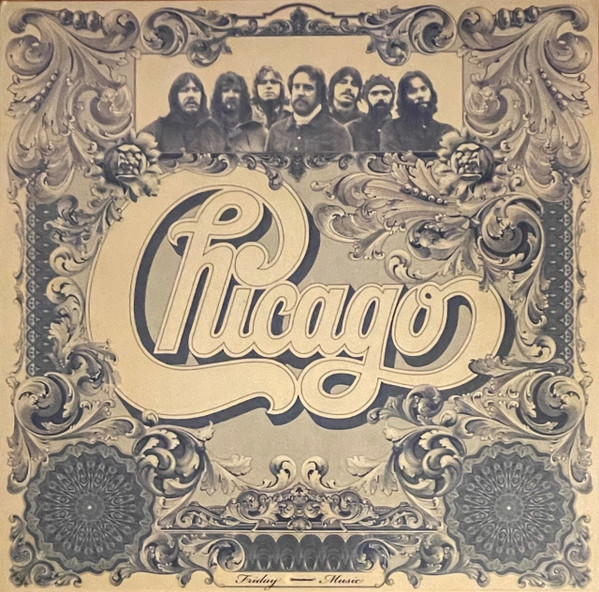

# Chicago VI

By Chicago

## Album Data

[Discogs URL](https://www.discogs.com/release/3663971-Chicago-Chicago-VI)

- Label: Friday Music
- Formats: Vinyl, LP, Album, Reissue, Remastered
- Genres: Rock, Soft Rock, Pop Rock, Classic Rock
- Rating: 4.36
- Released: 2011
- Year: 1973
- Release ID: 3663971
- Media condition: 
- Sleeve condition: 
- Speed: 
- Weight: 
- Notes: 

## Album Tracks

| **Position** | **Title** | **Duration** |
|--------------|-----------|--------------|
| A1 | **Critics' Choice** |  |
| A2 | **Just You 'N' Me** |  |
| A3 | **Darlin' Dear** |  |
| A4 | **Jenny** |  |
| A5 | **What's This World Comin' To** |  |
| B1 | **Something In This City Changes People** |  |
| B2 | **Hollywood** |  |
| B3 | **In Terms Of Two** |  |
| B4 | **Rediscovery** |  |
| B5 | **Feelin' Stronger Every Day** |  |

## Artist Roles

| **Name** | **Role** |
|----------|----------|
| **Laudir de Oliveira** | Congas |
| **American Bank Note Company** | Cover [Cover Produced By] |
| **John Berg** | Cover, Design [Cover Design] |
| **Nick Fasciano** | Cover, Design [Cover Design] |
| **Ron McMaster** | Lacquer Cut By |
| **Joe Reagoso** | Mastered By |
| **Ron McMaster** | Mastered By |
| **Rich Blakin** | Mixed By [Engineering Mix Assistant] |
| **Phil Ramone** | Mixed By [Engineering Mix] |
| **J.G. O'Rafferty** | Pedal Steel Guitar [Pedal Steel] |
| **Barry Feinstein** | Photography By [Photographs] |
| **James William Guercio** | Producer |
| **Jeff Guercio** | Recorded By [Engineering Recording Assistant] |
| **Wayne Jarnowski** | Recorded By [Engineering Recording] |
| **Joe Reagoso** | Remastered By [Mastered By] |

