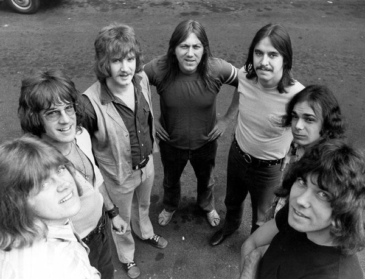

# Chicago

## Artist Profile

American pop/jazz-rock group. One of the biggest-selling bands in U.S. history, hailing from the Windy City (Chicago, Illinois). Formed in 1967 as "The Big Thing", they were one of the first groups to successfully fuse rock with a horn section. This blend worked well for them into the late 1970s, until they started to shift towards a more adult-contemporary style, with bassist Peter Cetera becoming the main vocalist. They haven't put out much original material in recent years but tour to the masses every year since they started. In dance music circles, they are best known for their minor hit, "Streetplayer", which Kenny &quot;Dope&quot; Gonzalez sampled for his 1995 track, "The Bomb!" (released under the alias of The Bucketheads).

NOTE: When dating reissues and repressing - The cursive (trademarked) "Chicago TM" logo starts to appear after 1976 on labels (as seen here) Chicago X Pre-1975 USA pressings do not show the cursive logo until after 1976.

## Artist Links

- [https://chicagotheband.com/](https://chicagotheband.com/)
- [https://www.facebook.com/Chicago.Official/](https://www.facebook.com/Chicago.Official/)
- [https://twitter.com/chicagotheband](https://twitter.com/chicagotheband)
- [https://www.instagram.com/chicagotheband/](https://www.instagram.com/chicagotheband/)
- [https://en.wikipedia.org/wiki/Chicago_(band)](https://en.wikipedia.org/wiki/Chicago_(band))

## See also

- [Chicago VI](Chicago_VI.md)
